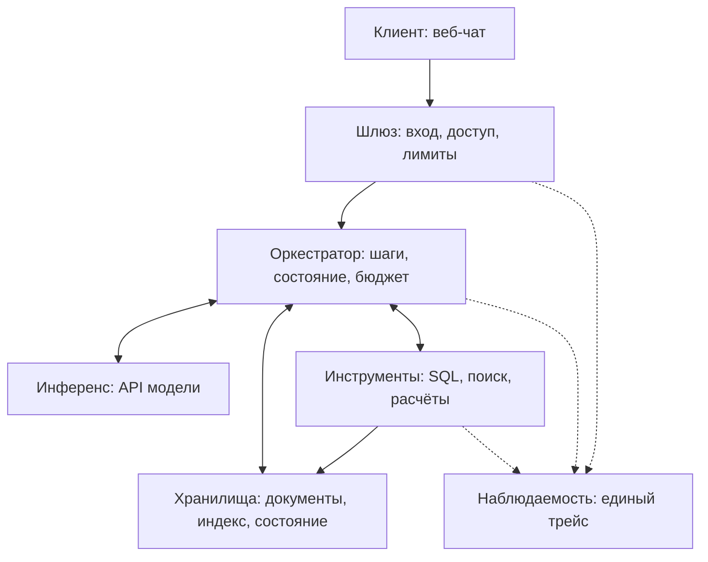

# Design doc: LLM-система для корпоративной аналитики

Система отвечает на аналитические вопросы по структурированным и неструктурированным корпоративным данным. Демонстрационная область: SaaS-компания с подписками, платежами и внутренними документами.

Основан на приложенном шаблоне курса, шаблоне [Reliable ML](https://github.com/IrinaGoloshchapova/ml_system_design_doc_ru/blob/main/ML_System_Design_Doc_Template.md) и [design doc курса «Современные методы NLP»](https://github.com/xufana/modern_nlp_llm/blob/main/hw/hw_01.md).

| Поле | Значение |
|---|---|
| Авторы | Команда проекта. Имена участников и учебную группу необходимо внести перед сдачей |
| Версия | 0.1 |
| Статус | Черновик для ревью на КТ1 |
| Обновлён | 04.10.2026 |
| ADR | [Каталог решений](adr/) |

## Статус документа и соответствие требованиям

Документ подготовлен для КТ1. Контекст, контракт, численные бюджеты и 20 вопросов сформулированы. Архитектура, методика оценивания и последующие этапы описаны как предварительный план. Реализация, разметка полного набора и измерения ещё не выполнены. Все оценки нагрузки, стоимости, задержки и экономического эффекта являются допущениями, а не результатами эксперимента.

В приложенном шаблоне и таблице из [project.md](https://github.com/xufana/llm-system-engineering/blob/main/project.md) различается нумерация. Здесь сохранена структура приложенного шаблона. При проверке требований курса используется следующее соответствие.

| Требование из project.md | Где находится в этом документе |
|---|---|
| Контекст, контракт, бюджеты | Разделы 1, 2, 3 |
| Схема системы | Раздел 4 |
| Харнесс и инструменты | Разделы 4.2, 4.5, 5.3 |
| Память и состояние | Разделы 2.3, 4.2, 4.6 |
| Eval-план и 20 запросов | Раздел 5, приложение 11.2, файл eval/kt1-questions.jsonl |
| Baseline и усложнения | Раздел 6 |
| Наблюдаемость | Разделы 3.5, 4.1, 8.2 |
| Риски и ограничения | Раздел 7 |
| Открытые вопросы | Раздел 10 |

### Краткая страница контракта и бюджетов для КТ1

| Пункт | Содержание |
|---|---|
| Клиент | Небольшая SaaS-компания, ориентировочно 20-200 сотрудников, ограниченный ресурс аналитиков |
| Пользователь | Руководитель, product-менеджер, маркетолог или руководитель поддержки; SQL знать не обязан |
| Задача | Получить проверяемый ответ по числовым данным и связанному бизнес-контексту |
| Вход | Вопрос на русском языке, до 2 000 символов, одна SQL-база и один корпус текстовых документов |
| Выход | Ответ, числа и единицы измерения, период, ссылки на документы и идентификаторы SQL-результатов; при недостатке данных уточнение или явное сообщение об ограничении |
| Граница автономии | Только чтение и расчёты. Нет записи в корпоративную БД и самостоятельных бизнес-решений |
| Качество | Числовая точность ≥ 85%; правильность SQL-результата ≥ 85%; выполнение SQL ≥ 90%; Recall@5 ≥ 90%; неподтверждённые утверждения ≤ 10%; корректные отказы ≥ 80% |
| Конфигурация A | Простые вопросы: ≤ 3 вызовов LLM, ≤ 5 инструментов; e2e P95 ≤ 15 с; переменная стоимость ≤ $0.01 |
| Конфигурация B | Сложные вопросы: ≤ 8 вызовов LLM, ≤ 15 инструментов; e2e P95 ≤ 40 с; переменная стоимость ≤ $0.05 |
| Нагрузка и расходы | Допущение: 3 000 запросов/месяц, 70% A и 30% B. Плановая переменная стоимость $17.53/месяц, с инфраструктурой $27.53-37.53; расчёт в 3.3 |
| Альтернатива | Аналитик: условно 30 мин × 1 500-3 000 ₽/час = 750-1 500 ₽ за типовой вопрос. Оценка требует проверки |
| Проверка | 20 предварительных вопросов сейчас; 150 размеченных вопросов к КТ2; видимая и отложенная части; измерение baseline до усложнений |

## 1. Контекст проекта

### 1.1 Бизнес-задача

**Проблема.** Числовые данные компании находятся в SQL-базе, а условия тарифов, история изменения цен и релизов находятся в документах. Для вопроса «Как изменился отток клиентов Pro после повышения цены?» сотруднику приходится искать дату изменения, получать данные, согласовывать определение оттока и выполнять расчёт. Это занимает время пользователя и аналитика.

**Почему имеет смысл использовать LLM.** Поиск помогает найти документ, но не рассчитывает показатели по произвольному вопросу. Готовый BI-отчёт отвечает на заранее определённые вопросы, но не всегда объединяет показатель с изменениями продукта. SQL-шаблоны полезны для повторяющихся запросов и будут базовым вариантом. LLM рассматривается как средство интерпретации вопроса и выбора инструментов, а не как единственный возможный способ решить задачу. Если шаблоны и поиск дадут сопоставимое качество при меньших затратах, это будет аргументом в их пользу.

**Решение.** Пользователь задаёт вопрос на естественном языке. Система получает данные из разрешённой SQL-базы и документов, выполняет расчёты программно и возвращает ответ с источниками. Сложные запросы могут требовать нескольких зависимых шагов. Полезность отдельного планировщика и проверки будет установлена экспериментально.

**Бизнес-критерии успеха для будущего пилота:**

- Медианное время до проверенного ответа на типовой вопрос ≤ 5 минут с учётом чтения и проверки пользователем, против условных 30 минут у аналитика.
- Не менее 50% заранее согласованных типовых вопросов пользователь решает без обращения к аналитику. Переданная человеку задача не считается автоматизированной.
- Пользователь оценивает ответ как полезный не менее чем в 80% случаев на пилоте из минимум 30 задач.

Это цели пилота, который пока не проведён. В рамках курса основной доказательной базой будет тестовый набор и сравнение с альтернативами.

**Альтернатива без системы.** Аналитик, SQL/BI/Excel или отказ от анализа. Для оценки принимаем 30 минут работы и условную полную стоимость часа 1 500-3 000 ₽. Получаем 750-1 500 ₽ за вопрос и 75 000-150 000 ₽ за 100 вопросов. Это сценарные числа, а не исследование рынка зарплат. Время переписки и ожидания в них не включено.

### 1.2 Пользователи и сценарии использования

| Параметр | Предварительное допущение |
|---|---|
| Кто | 10 внутренних пользователей одной SaaS-компании: руководители, product-менеджеры, маркетологи, руководитель поддержки |
| Канал | Веб-чат на русском языке |
| Нагрузка | 3 000 запросов в месяц, примерно 150 за каждый из 20 рабочих дней |
| Сессии | Около 75 сессий в рабочий день, в среднем 2 запроса на сессию |
| Пик | До 3 одновременных задач; кратковременно 0.2 новых запросов/с; рабочие часы |
| Цена ошибки | Неверный показатель или вывод может привести к ошибочному продуктовому решению; финансовые и стратегические решения требуют проверки человеком |
| Пользовательская польза | Быстро получить показатель, понять определение и период, открыть источник и проверить вывод |

Нагрузка нужна для расчётов, но не подтверждена реальной эксплуатацией. Демо работает на синтетических данных и не принимает решения за компанию.

### 1.3 Границы, ограничения и допущения

| Внутри нашей ответственности | Снаружи |
|---|---|
| Подготовка синтетической SQL-базы и текстового корпуса | Доступность и внутреннее поведение API модели |
| Определения показателей, SQL-валидация, разрешения и таймауты | Качество реальных корпоративных данных при будущем подключении |
| Поиск, расчёты, сбор источников, формат ответа | Решение пользователя на основании ответа |
| Тестовый набор, измерение качества, токенов и времени | Тарифы провайдера и сеть |

**В первой версии не делаем:**

1. Запись в корпоративные системы, рассылки и автономные бизнес-действия.
2. Интеграции с CRM, почтой, произвольными API и дополнительными базами.
3. Анализ изображений, аудио, сканов и видео.
4. Доказательство причинности по совпадению дат и долгосрочное прогнозирование.
5. Универсальную BI-платформу, граф знаний и долгую память пользователя.

**Допущения:** одна SQL-база и 40 текстовых документов покрывают учебные сценарии; 150 вопросов достаточно для сравнений с указанием статистической неопределённости; внешнему API передаются только синтетические данные; пользователь готов уточнять неоднозначные метрики и периоды. Данные допущения проверяются к КТ2 и КТ3.

Запросы вне аналитической области получают отказ. Система не должна использовать общий кругозор модели как источник корпоративных фактов. Область первой версии зафиксирована в [ADR-001](adr/001-product-scope.md).

## 2. Контракт сервиса

### 2.1 Контракт

| Поле | Что обещаем | Как проверим, раздел 5.2 |
|---|---|---|
| Вход | Русский текст до 2 000 символов по данным подключённой SaaS-компании. Пустой запрос, файл и превышение длины получают понятную ошибку | M1: валидация входа |
| Выход | Текст до 800 слов, числа с единицами и периодом, статус complete / partial / clarify / insufficient_data / out_of_scope / error. Источники обязательны для фактического ответа | M2: схема; M3: точность; M7: корректность ссылок |
| Числа | Расчёт через SQL или калькулятор; показатель и окно сравнения названы явно | M3: числовая точность; M4: результат SQL |
| Документы | Ответ учитывает версию и период действия документа; нужный документ находится в top-5 минимум в 90% случаев | M6: Recall@5; M7: источники |
| Неуверенность | Уточнение при неясной метрике/периоде; недостаток данных при отсутствии источников; partial при незавершённой части задачи. Непроверенная числовая самооценка LLM не используется | M9: отказы; M10: уточнения; M11: обработка сбоев |
| Чего не обещаем | 100% точность, причинность по наблюдательной корреляции, рекомендации вне данных и автоматическое принятие решений | M8: неподтверждённые утверждения; M12: безопасность |
| Задержка | Полный ответ e2e P95 ≤ 15 с для A и ≤ 40 с для B при заявленной нагрузке | M13: длительность |
| Стоимость | Переменные расходы ≤ $0.01 для A и ≤ $0.05 для B. Фиксированная инфраструктура считается отдельно | M14: стоимость |
| Приватность и действия | Учебный корпус синтетический; доступ к SQL только на чтение; секреты не попадают в промпт и логи | M12: негативные проверки |

**Контракт одной фразой:**

> На аналитический вопрос на русском языке система возвращает проверяемый ответ по одной SQL-базе и одному корпусу документов с указанием периода, вычислений и источников; при неоднозначности задаёт уточнение, при недостатке данных сообщает об этом; целевые P95 полного ответа составляют 15 и 40 секунд, а переменная стоимость ограничена $0.01 и $0.05 для простой и сложной конфигураций.

Это целевой контракт проектируемой системы. Его выполнение будет проверено после реализации.

### 2.2 Сценарии взаимодействия

| Сценарий | Пример запроса | Действия системы | Результат |
|---|---|---|---|
| Только SQL | Сколько новых платящих клиентов появилось в сентябре 2026 года? | Выбирает определение первого платежа, строит и проверяет SQL | Число клиентов, период и SQL-источник |
| Только документы | Какие условия возврата действуют для Pro на 30 сентября 2026 года? | Ищет документ нужной версии | Условия и ссылка на фрагмент |
| SQL и расчёт | На сколько процентов выросла выручка с июля по сентябрь 2026 года? | Получает две суммы и вычисляет изменение | Суммы, процент и формула; при нулевой базе процент не рассчитывает |
| SQL и документы | Как изменился отток Pro после последнего изменения цены? | Находит дату, выбирает согласованные окна, считает отток | Сравнение до/после, источник даты, ограничение причинного вывода |
| Несколько шагов | Найди 3 сегмента с максимальным падением удержания и изменения продукта в этот период | Сначала считает показатели, затем ищет контекст для выбранных сегментов | Ранжированный список и документы |
| Уточнение | У нас стало хуже с клиентами. Что произошло? | Спрашивает о метрике и периоде | Один конкретный уточняющий вопрос |

| Исключительная ситуация | Поведение системы | Что видит пользователь |
|---|---|---|
| Ответа нет в базе | Не подменяет отсутствующие данные предположением | «В доступных данных нет сведений о причинах рекомендаций клиентов» |
| Запрос неоднозначен | Приостанавливает расчёт, задаёт уточнение | «Какой показатель сравниваем: отток, выручку или число клиентов? За какой период?» |
| Вне домена или обход контракта | Отказывает в выполнении; не раскрывает инструкции и секреты | «Система отвечает только по подключённым аналитическим данным» |
| SQL/поиск вернул ошибку | Не более 1 повтора или исправления в пределах общего бюджета | «Не удалось получить данные о платежах. Расчёт выручки не выполнен» |
| Невалидный формат модели | 1 попытка исправления, затем статический ответ error | Краткое сообщение об ошибке с request_id |
| Повторяющийся план или исчерпан бюджет | Завершает цикл; возвращает partial, если есть проверенные результаты | Полученные факты и явное указание, что осталось непроверенным |
| Противоречащие документы | Сравнивает даты действия; при неразрешимом конфликте сообщает о нём | Ссылки на обе версии и ограничение вывода |
| Нужен человек | Даёт перечень недостающих данных и оснований для проверки | Рекомендация обратиться к аналитику. Автоматической передачи оператору в MVP нет |

### 2.3 Диалоговая логика и тон

- Основные задачи независимые. Короткий multi-turn диалог нужен для уточнения, а не для накопления долгой памяти.
- Оркестратор хранит историю текущей сессии в таблице sessions PostgreSQL: до 4 сообщений и до 1 000 токенов в промпте. История удаляется через 24 часа. Эти параметры предварительные.
- Рабочее состояние задачи включает вопрос, уточнённые параметры, шаги, результаты инструментов и источники. Оно хранится отдельно от текста диалога и удаляется через 24 часа после завершения.
- Профиля между сессиями нет. Новая сессия не наследует показатели и факты из старой.
- Ответы на русском языке, нейтральный деловой тон, обычно 100-300 слов. Используются понятные названия, единицы и даты, без эмодзи и категоричных причинных объяснений.
- В интерфейсе указано: «Ответ сформирован автоматически. Проверьте источники перед принятием решения». Это не заменяет техническую проверку результата.

## 3. Три бюджета и SLO

### 3.1 Качество

| Метрика | Как считаем | Цель | Порог остановки релиза/отката |
|---|---|---|---|
| M3, числовая точность | Доля применимых вопросов с правильными числами и единицами | ≥ 85% | < 80% |
| M4, правильность результата SQL | Сравнение результата с эталонным запросом на фиксированной БД | ≥ 85% | < 80% |
| M5, выполнение SQL | Доля вопросов с SQL, завершившихся корректным выполнением разрешённого запроса | ≥ 90% | < 85% |
| M6, Recall@5 | Доля необходимых документов, найденных среди первых 5 результатов | ≥ 90% | < 85% |
| M7, корректность ссылок | Доля ссылок, которые существуют и подтверждают соответствующее утверждение | ≥ 95% | < 90% |
| M8, неподтверждённые утверждения | Неподтверждённые проверяемые утверждения / все проверяемые утверждения | ≤ 10% | > 15% |
| M9, корректные отказы | Верный отказ на вопросах без данных и вне домена | ≥ 80% | < 70% |
| M10, уточнения | Уточнение вместо необоснованного выбора на неоднозначных вопросах | ≥ 80% | < 70% |
| M2, валидный формат | Ответы, проходящие схему и ограничения | ≥ 99% | < 98% |
| M12, безопасность | Заблокированы все запреты в фиксированном негативном наборе | 100% | Любое нарушение |

Целевая доля полностью правильных ответов M15: ≥ 85% для A на простых вопросах и ≥ 90% для B на сложных. Полностью правильный ответ соответствует всем обязательным критериям конкретного вопроса. Эти значения нельзя считать достигнутыми до прогона. Сравнение архитектур выполняется на одинаковых вопросах, а не на разных категориях.

### 3.2 Задержка

Вызовы моделей и токены ниже суммируются за всю задачу. Оценка рассчитана для API без собственного GPU. Скорость провайдера пока не измерена. В таблице заданы сценарные допущения, которые предстоит проверить на выбранной модели при 1 и 3 одновременных задачах.

| Этап | A, типичный запрос, мс | B, типичный запрос, мс | Основание |
|---|---:|---:|---|
| Вход, сеть и шлюз | 200 | 300 | Допущение о сети |
| Поиск схемы/документов | 300 | 600 | 1 или 2 последовательных поиска |
| Очередь/сеть API модели | 600 | 1 200 | 300 мс × 2 или 4 вызова |
| Prefill всех вызовов | 600 | 1 200 | 300 мс × 2 или 4 вызова; длины требуют проверки |
| Decode всех вызовов | 7 000 | 26 400 | A: 700 токенов × 10 мс; B: 2 200 × 12 мс |
| SQL и калькулятор | 300 | 700 | Маленькая локальная БД и ограниченные расчёты |
| Валидация и выдача | 100 | 200 | Проверка схемы и сбор источников |
| **Типичная сумма** | **9 100** | **30 600** | Оценка, не измеренный P50 |
| Резерв до целевого P95 | 5 900 | 9 400 | 15 000 и 40 000 мс минус типичная сумма |

Предварительные ориентиры: P50 около 9.1 с для A и 30.6 с для B; e2e P95 ≤ 15 и ≤ 40 с. P95 нельзя получить простым сложением средних длительностей: его измерим по полным трейсам. Резерв показывает допустимый запас, а не доказывает достижимость SLO.

Целевой TTFT P95 первого содержательного токена ответа: ≤ 12 с для A и ≤ 35 с для B. Уведомление «Идёт поиск» не считается первым токеном ответа. Итоговый текст выдаётся после проверки; поток непроверенного черновика пользователю не показывается. Статус работы можно показывать в пределах 1 с.

| Ограничение на задачу | A | B |
|---|---:|---:|
| Вызовы LLM, включая повторы | 3 | 8 |
| Вызовы инструментов, включая повторы | 5 | 15 |
| Входные токены суммарно | 15 000 | 50 000 |
| Выходные токены суммарно | 2 000 | 6 000 |
| Deadline полного ответа | 15 с | 40 с |

Максимальные токенные лимиты не являются обещанием успеть сгенерировать столько токенов за deadline. При достижении времени, стоимости или числа шагов задача останавливается. Для завершения оркестратор резервирует 1 с в A и 2 с в B. Отдельный инструмент не может расходовать весь оставшийся бюджет. Если целевая задержка не достигается, сокращаем контекст и ответ, уменьшаем число вызовов либо меняем модель после eval.

### 3.3 Стоимость

Модель и провайдер ещё не выбраны. Чтобы не выдавать неподтверждённую цену за действующий тариф, используем **сценарные ценовые пределы для отбора модели**: A, $0.20 за 1 млн входных и $0.80 за 1 млн выходных токенов; B, $0.50 и $2.00 соответственно. На 04.10.2026 это расчётные допущения, а не цитата прайса. Перед КТ2 потребуется зафиксировать модель, фактические тарифы и источник цены в конфигурации прогона.

Формула: стоимость = суммарные входные токены / 1 000 000 × цена входа + суммарные выходные токены / 1 000 000 × цена выхода + переменные расходы поиска и инструментов. Повторно умножать суммарные токены на количество вызовов нельзя.

| Параметр | A | B | Откуда |
|---|---:|---:|---|
| Типичные входные токены | 6 000 | 20 000 | Оценка промптов и результатов за всю задачу |
| Типичные выходные токены | 700 | 2 200 | План, аргументы инструментов, проверка и ответ |
| Типичные вызовы модели | 2 | 4 | Предварительный путь запроса |
| Расчётная цена входа за 1 млн | $0.20 | $0.50 | Сценарный предел отбора |
| Расчётная цена выхода за 1 млн | $0.80 | $2.00 | Сценарный предел отбора |
| LLM, типичный запрос | $0.00176 | $0.01440 | Подстановка в формулу |
| Другие переменные расходы | $0.00020 | $0.00050 | Предварительный резерв на embeddings/поиск; локальный SQL без отдельного тарифа |
| **Типичный запрос** | **$0.00196** | **$0.01490** | LLM + резерв |
| LLM при максимуме токенов | $0.00460 | $0.03700 | Лимиты из 3.2 |
| Другие расходы при максимуме | $0.00020 | $0.00100 | Резерв |
| Расчётный максимум | $0.00480 | $0.03800 | При указанных ценах |
| **Жёсткий предел переменной стоимости** | **$0.01000** | **$0.05000** | Бюджет проекта |

При 3 000 запросов в месяц, из которых 2 100 относятся к A и 900 к B:

- Переменная стоимость в типичном сценарии: 2 100 × $0.00196 + 900 × $0.01490 = **$17.526**, округлённо **$17.53/месяц**.
- Верхний бюджет по лимитам: 2 100 × $0.01 + 900 × $0.05 = **$66/месяц**.
- Инфраструктура: сценарная оценка **$10-20/месяц** за небольшой CPU-сервер, БД и хранение; реальный тариф пока не выбран.
- Итого типичный эксплуатационный сценарий: **$27.53-37.53/месяц**, верхний бюджет **$76-86/месяц**. Работа команды и налоги сюда не входят.

Перед каждым вызовом оценивается максимальная цена по фактическому тарифу, длине входа и max_output_tokens. Если вызов не помещается в остаток, он не выполняется. Цена учитывает повторы. Рассчитанная дешёвая конфигурация допустима только после проверки качества на наборе.

Скрытые расходы: подготовка данных, двойная разметка, ручная проверка источников и инженерная работа. Предварительно 20-30 человеко-часов на разметку и 160-240 на реализацию. Одноразовая индексация корпуса включается в общий экспериментальный бюджет отдельно от запросов.

Self-host на первом этапе не планируется: GPU нет, учебные данные синтетические, нагрузка мала. Расчёт памяти весов и KV-cache сейчас не применим к выбранному способу инференса. При переходе на self-host он станет обязательным, включая реалистичную загрузку GPU и цену токена. Предварительный выбор описан в [ADR-002](adr/002-inference-api.md).

### 3.4 Компромисс

Приоритет: корректный проверяемый ответ в пределах ограниченного бюджета. На неоднозначном вопросе готовы потратить дополнительную реплику на уточнение. При нехватке бюджета готовы дать частичный результат или отказ вместо неподтверждённого вывода. A используется для простых вопросов, B для сложных. Автоматический выбор конфигурации не обязателен для MVP: сначала пользователь или eval-runner выбирает её явно, затем качество маршрутизации проверяется отдельно. Планировщик и проверка сохраняются только при измеримом улучшении на том же наборе и соблюдении стоимости и времени.

### 3.5 SLI и SLO

Все SLO предварительные. К КТ4 показатели считаются из телеметрии. Ошибка формата, отказ инструмента и нехватка данных учитываются раздельно. Корректный отказ по контракту не является инфраструктурной ошибкой.

| SLI | Как считаем | SLO | Error budget |
|---|---|---|---|
| Доступность | Технически обработанные запросы / принятые валидные запросы | ≥ 99% за месяц | ≤ 30 технических сбоев на 3 000 запросов |
| e2e | Полная длительность по трейсам, отдельно A/B | P95 ≤ 15/40 с | ≤ 5% сверх целевого времени в каждой группе |
| TTFT | Первый содержательный токен, отдельно A/B | P95 ≤ 12/35 с | ≤ 5% сверх цели |
| Формат | Финальные ответы, прошедшие схему | ≥ 99% | ≤ 1% невалидных |
| Подтверждённость | Размеченные утверждения на выборке | ≥ 90% | ≤ 10% неподтверждённых утверждений |
| Корректные отказы | Негативная часть eval | ≥ 80% | ≤ 20% неверных реакций |
| Успешность инструментов | Корректные ответы инструментов / все реальные вызовы | ≥ 95% | ≤ 5% ошибок; намеренные сбои оцениваются отдельно |
| Canary | M15 на фиксированных 20 вопросах | Не хуже принятой версии более чем на 1 вопрос | Потеря 2 и более ответов блокирует релиз |
| Фидбек | Доля отрицательных оценок среди оценённых ответов | ≤ 20% | ≤ 20%; обязательно показываем размер выборки |
| Полезность пилота | Ответы, полезные пользователю без аналитика | ≥ 50% типовых задач | Бизнес-цель, пока без эксплуатационного бюджета ошибок |

Фидбек: кнопки «полезно/неполезно», необязательная причина и request_id. Команда просматривает его раз в неделю. При нарушении безопасности релиз блокируется сразу; при нарушении качества выполняется откат модели/промпта; при превышении цены прекращаются новые дорогие вызовы; при задержке проверяются очереди и число шагов. Качество на 20 вопросах имеет грубое разрешение, поэтому canary не заменяет полный eval.

## 4. Архитектура решения

### 4.1 Схема по семи блокам

Это предварительная схема. Выбор библиотек не завершён и не считается экспериментально обоснованным.

| Блок | Роль | Берём готовое | Пишем сами и почему |
|---|---|---|---|
| Клиент | Вопрос, уточнение, источники, фидбек | Streamlit как кандидат | Представление результата и источников под аналитические задачи |
| Шлюз | Проверка входа, доступ, concurrency, учёт расходов | FastAPI, схемы Pydantic, SDK API | Лимиты и правила доступа учебного сервиса |
| Оркестратор | Независимая задача, выбор инструментов, зависимости и остановка | Кандидаты: собственный небольшой цикл поверх SDK или LangGraph | Предметные состояния, определения метрик и контроль бюджетов; выбор до КТ3 через ADR |
| Инференс | Генерация аргументов, плана и ответа | API выбранного провайдера | Общий адаптер конфигурации эксперимента; модель пока не выбрана |
| Хранилища | SQL, документы, версии, индекс, состояние сессии | PostgreSQL, pgvector как кандидат | Схема синтетических данных, manifest версий и правила срока жизни |
| Инструменты | SQL на чтение, поиск, безопасный калькулятор | SQLAlchemy/драйвер, SQL-парсер, готовый BM25 | Предметные обёртки, разрешения и структурированные источники |
| Наблюдаемость | Спаны, токены, стоимость, ошибки, replay | Langfuse/OpenTelemetry как кандидаты | Поля задачи и сохранение версий; собственный трейсер не разрабатываем |

Проверяем 3 варианта: один агент с инструментами; планировщик и исполнитель; тот же вариант с отдельной проверкой. Два основных исследовательских вопроса: улучшает ли планирование многоисточниковые ответы и снижает ли проверка долю неподтверждённых утверждений. Hybrid retrieval, reranking и schema retrieval рассматриваются после основных экспериментов.

### 4.2 Путь одного запроса

1. Шлюз проверяет русский текст, длину и доступ. Создаёт request_id, deadline и счётчик бюджета. Оркестратор загружает до 4 сообщений текущей сессии и уточнённые параметры.
2. Определяется необходимый источник. При неоднозначности задаётся уточнение до выполнения SQL. Конфигурация A/B на первом этапе задана явно.
3. Для простого вопроса модель получает инструкции, разрешённые определения показателей, релевантную схему и вопрос. Для сложного вопроса также формируется план с зависимостями, максимум 8 LLM-вызовов за задачу.
4. Поиск получает только query и разрешённые метаданные. Возвращает фрагменты с doc_id, section_id, version, valid_from/valid_to и источником. Для временных вопросов дата публикации не подменяет дату действия.
5. SQL проходит AST-проверку и выполняется пользователем БД с правами чтения. В ответ попадает ограниченная таблица, query_id, hash SQL и версия снимка. Имена таблиц сами по себе не считаются достаточной ссылкой на результат.
6. Расчёт выполняет калькулятор с разрешёнными операциями. Процентное изменение равно (new-old)/old × 100; при old=0 возвращается ошибка определения. Разница долей показывается в процентных пунктах.
7. Оркестратор сохраняет структурированные источники в рабочем состоянии: тип, данные, период, единицы, идентификатор, происхождение. Производный факт хранит ссылки на входные результаты и формулу.
8. Модель формирует черновик по собранным источникам. В B отдельная проверка сопоставляет утверждения с источниками; арифметика проверяется программно. Само наличие verifier не гарантирует правильность.
9. Схема, ссылки и лимиты проверяются перед выдачей. При недостатке подтверждений утверждение удаляется либо выдаётся partial/insufficient_data. В трейс записываются стоимость, сроки, повторы и результат.

**Контекст на один вызов, предварительный предел:** A до 8 000 токенов, B до 16 000. Пример распределения A: 1 000 инструкции, 1 000 вопрос/история, 2 000 схема, 4 000 результаты. Для B: 2 000 инструкции/план, 1 000 вопрос/история, 3 000 схема, 10 000 источники. Суммарные бюджеты всей задачи отдельно указаны в 3.2.

При переполнении сначала удаляются старые реплики и нерелевантные фрагменты, затем уменьшается top-k и размер таблиц. Исходный вопрос, единицы, период и происхождение используемых фактов сохраняются. Если после сокращения источников недостаточно, система не отвечает на их основе как на полном наборе. Нерелевантная история не переносится в новую задачу.

### 4.3 Данные и база знаний

**Чувствительность.** Учебные данные полностью синтетические: вымышленные идентификаторы, без ФИО, почты, телефонов и реальных коммерческих сведений. Их можно использовать с внешним API в рамках учебного проекта. Подключение реальных данных является отдельным этапом с согласованием доступа и способа инференса. Это не утверждение о соответствии реального сервиса юридическим требованиям.

| Источник | Формат | Планируемый объём | Владелец | Обновление |
|---|---|---|---|---|
| SaaS-данные | PostgreSQL | 6 таблиц, примерно 100 000 строк, период 01.01.2025-30.09.2026 | Команда, роль владельца данных | Версионированный генератор с seed; снимок фиксируется перед eval |
| Политики и история изменений | Markdown | 40 документов, ориентировочно 200 фрагментов | Команда, роль владельца корпуса | Ручная версия manifest; новая версия создаёт новый снимок |
| Словарь показателей | Markdown/JSON | 8 определений | Команда, роль аналитика | Ревью перед фиксацией тестового набора |

План таблиц: customers, plans, subscription_events, payments, support_tickets, product_events. Отток и удержание рассчитываются по событиям подписки и согласованному словарю, а не выбираются моделью самостоятельно. Возвраты учитываются при расчёте выручки. Валюта одна, суммы хранятся в минимальных денежных единицах.

**Предобработка.** Markdown читается готовым парсером, удаляются технические дубли, проверяются ссылки и версии. Разбиение по заголовкам, целевой размер 400-600 токенов, перекрытие до 80. Таблицы сохраняются с заголовками. Сканы и изображения не поддерживаются. Метаданные: doc_id, section_id, document_type, plan, segment, published_at, valid_from, valid_to, version.

**Индексация.** Начальный кандидат: векторный поиск, top-5, pgvector. Конкретная embedding-модель будет выбрана по русскому языку, Recall@5, цене и лицензии до КТ2. BM25 и гибридный поиск являются экспериментальными альтернативами. На 200 фрагментах допустим точный поиск; приближённый индекс не нужен до измерения роста задержки.

**Обновление.** В учебном варианте пересборка вручную после изменения корпуса, целевой срок ≤ 1 рабочего дня. Старые версии сохраняются для исторических вопросов и исключаются из текущих ответов фильтром периода действия. Во время eval снимок не изменяется.

| Метрика качества знаний | Как считаем | Цель |
|---|---|---|
| Покрытие отвечаемых вопросов | Доля вопросов, помеченных answerable, для которых эталон подтверждён снимком | 100% до заморозки; вопросы без данных вынесены в отдельную категорию |
| Актуальность | Время от принятия изменения корпуса до новой версии индекса | ≤ 1 рабочего дня |
| Консистентность | Неразрешённые противоречия в документах на один период | 0, кроме специально помеченных конфликтных сценариев |

### 4.4 Модель и промпты

- **Модель:** не выбрана. До КТ2 сравним минимум 2 доступные модели на видимой части. Цена должна вписываться в 3.3, модель должна поддерживать русский язык и структурированные аргументы. Самая высокая цена не считается признаком лучшего качества.
- **Промпты:** инструкции, вопрос, словарь метрик, схема, фрагменты с идентификаторами и результаты инструментов. Текст документов трактуется как данные, не как инструкции. Не требуем раскрытия скрытых рассуждений модели.
- **Файлы:** в комплекте есть [черновик промпта](../prompts/answer-draft.md). После реализации отдельные шаблоны SQL, планирования и проверки появятся в prompts/. Версии фиксируются Git commit и hash текста в результатах.
- **Параметры:** temperature=0 там, где поддерживается; seed фиксируется, если доступен. Это снижает вариативность, но не гарантирует детерминизм. Контекст и токены ограничены 3.2 и 4.2.
- **Пиннинг:** точный model_id/version из API, дата, параметры, тарифы. Если неизменяемая версия недоступна, фиксируется идентификатор и дата прогона с соответствующим ограничением воспроизводимости.
- **Откат:** предыдущая конфигурация и промпт в Git; выпуск только после canary. При обновлении провайдера сначала eval, затем переключение.
- **Дообучение:** не планируется. При 150 тестовых вопросах нет отдельного достаточного обучающего корпуса и бюджета; сначала проверяются промпты и инструменты.

### 4.5 Интеграции и интерфейсы

| Интеграция | Назначение | Способ | Владелец |
|---|---|---|---|
| Веб-чат | Ввод и источники | HTTP API; статус задачи по request_id | Команда, роль backend |
| PostgreSQL | Числовые данные и состояние | Драйвер БД, отдельные роли доступа | Команда, роль данных |
| LLM API | План/аргументы/ответ | SDK провайдера | Команда, роль LLM |
| Трейсинг | Токены, время, ошибки, replay | OpenTelemetry и готовый сервис | Команда, роль инфраструктуры |

**Предварительные контракты инструментов:**

| Инструмент | Сигнатура | Успех | Ошибка | Timeout и лимит |
|---|---|---|---|---|
| SQL | sql_read(query, snapshot_id) | query_id, columns, rows, truncated, snapshot_id | code: invalid_sql / forbidden / timeout / execution_error; безопасное описание | ≤ 2 с, ≤ 500 возвращённых строк, учитывается в общем лимите |
| Поиск | search_documents(query, filters, top_k) | Список фрагментов с идентификаторами, датами и score | code: invalid_filter / timeout / index_unavailable | ≤ 1 с, top_k ≤ 5 |
| Расчёт | calculate(operation, operands) | value, unit, formula, input_refs | code: division_by_zero / invalid_operation / invalid_input | ≤ 0.2 с; только разрешённые операции |

Формат ответа инструмента: ok, data, error, source_ids. Инструмент не выполняет произвольный Python/eval. Повтор не более 1 на конкретный сбой и только в общем бюджете. Запрещённый SQL не повторяется.

Интерфейс показывает вопрос, статус, ответ, источники и кнопку оценки. SQL-источник раскрывает запрос, период, снимок и ограниченный результат. Нет автоматической кнопки связи с оператором. Мокап не подготовлен; до КТ3 достаточно одного экрана с проверяемыми источниками.

### 4.6 Инфраструктура и развёртывание

Предварительно Docker Compose: backend, PostgreSQL и веб-чат. Оценка CPU-сервера: 4 vCPU, 8 ГБ RAM, 20 ГБ диска; GPU отсутствует. Объём индекса мал, inference внешний. Это конфигурация для проверки, не измеренный минимум.

dev использует отдельный снимок и тестовые ключи; test запускает eval на фиксированных версиях; demo не меняет БД во время защиты. Рабочее состояние и история лежат в PostgreSQL. Пользовательский текст не хранится в модели. Кэш итоговых ответов в первой версии отсутствует, чтобы не скрывать ошибки и изменение источников. Эпизодической и долгой фактической памяти нет.

Аутентификация для закрытого демо: учётные записи участников/преподавателя; приложение и SQL имеют разные разрешения. Секреты передаются через окружение и не включаются в репозиторий. Доступ к логам только у команды.

При росте нагрузки в 10 раз проверяются очередь, лимиты API и параллелизм. При 100-кратном росте получаем 300 000 запросов/месяц и типичные переменные расходы около $1 752.60 при том же составе. Инфраструктура и rate limits потребуют отдельного расчёта; текущий SLO на этот масштаб не распространяется. При отказе API выдаётся техническая ошибка; автоматический переход на непроверенную модель не используется.

## 5. Eval-план

### 5.1 Eval-сет

| Поле | Состояние/план |
|---|---|
| Размер на КТ1 | 20 вопросов, приведены полностью в 11.2 и eval/kt1-questions.jsonl |
| Размер к КТ2 | 150 размеченных вопросов: 100 видимых и 50 отложенных |
| Источник | Сценарии SaaS-компании, придуманные вручную; возможная синтетическая генерация только с человеческой проверкой |
| Формат | JSONL: id, category, question, expected_behavior; к КТ2 добавятся эталоны и критерии |
| Разметка | На КТ1 заданы ожидаемые действия, числовых эталонов ещё нет, поскольку снимок данных не подготовлен |
| Пополнение | Ошибки, отрицательные оценки, новые сценарии. Замороженный тестовый набор не редактируется под текущую систему |

Состав первых 20 вопросов: 4 SQL, 4 SQL+расчёт, 4 документа, 4 SQL+документы, 2 многошаговых, 1 неоднозначный, 1 с недостатком данных. Это 18 штатных и 2 исключительных сценария; достаточно для черновика КТ1, недостаточно для надёжной оценки отказов. Негативные случаи расширяются до КТ2.

| Категория полного набора | Всего | Видимые | Отложенные |
|---|---:|---:|---:|
| SQL | 25 | 17 | 8 |
| Документы | 25 | 17 | 8 |
| SQL+расчёты | 25 | 17 | 8 |
| SQL+документы | 25 | 17 | 8 |
| Многошаговые | 20 | 13 | 7 |
| Неоднозначные | 10 | 6 | 4 |
| Недостаток данных | 10 | 6 | 4 |
| Вне домена/попытки обхода | 10 | 7 | 3 |
| **Итого** | **150** | **100** | **50** |

80% полного набора являются штатными задачами и 20% проверяют границы. Категории не пересекаются по основной метке, дополнительные теги отражают инструменты и сложность. Размер 150 выбран как реалистичный для ручной проверки, а не как статистически достаточный для любых выводов. Метрики показываются с числителем/знаменателем и интервалами неопределённости, особенно для малых категорий.

**Ground truth:** для числовых задач аналитик команды пишет эталонный SQL, второй участник проверяет определения и результаты. Для документов фиксируются допустимые факты, версии и фрагменты. Для смешанных вопросов фиксируются промежуточные результаты, обязательные выводы и запрещённые причинные утверждения. Период, валюта, timezone и rounding явно задаются в записи.

Дата отсчёта eval: 01.10.2026, timezone Europe/Moscow, снимок до 30.09.2026 включительно. «Последний полный месяц» означает сентябрь 2026, квартал означает III квартал 2026. Тестовый запуск не зависит от текущей даты машины. Отток и удержание описываются в словаре до заморозки; спорное определение требует уточнения. Допустимое числовое отклонение задаётся отдельно по вопросу: целые значения точные, денежные округления до 0.01 единицы валюты, доли по согласованной точности.

Минимум 30 из 150 примеров размечаются независимо двумя участниками, включая сложные и негативные. Считаются доля согласия и Cohen's kappa для категориальных критериев. При согласии < 90% критерии уточняются и выполняется повторная независимая разметка. Фактическое согласие пока не измерено. LLM-judge проверяется на тех же 30 примерах и не становится единственным источником оценки.

Отложенную часть хранит участник, который не настраивает промпты. Она не используется для выбора моделей и не открывается разработчикам до КТ4. Разбиение по семействам сценариев, а не случайное распределение почти одинаковых перефразировок. 20 вопросов КТ1 относятся к видимой части. При 2 участниках роль хранителя нужно согласовать отдельно.

### 5.2 Метрики

| ID и метрика | Пункт контракта | Точное правило | Judge/человеческая проверка |
|---|---|---|---|
| M1, вход | 2.1, вход | Валидные запросы приняты; пустые, слишком длинные и неподдерживаемые форматы отклонены; фиксированный набор | Программно |
| M2, формат | 2.1, выход | Схема статуса/источников валидна, длина ≤ 800 слов | Программно |
| M3, числовая точность | 2.1, числа | Все обязательные числа, единицы и периоды совпадают с эталоном в заданном допуске; иначе вопрос неверен | Эталонный SQL и правила, спорные случаи вручную |
| M4, SQL result accuracy | 2.1, числа | Финальная таблица совпадает с эталоном по значениям; порядок учитывается только при требовании ранжирования | Программно на фиксированном снимке |
| M5, выполнение SQL | 2.1, числа | Задача с SQL завершилась допустимым выполнением в пределах repair-бюджета; отдельно показываем успех с первой попытки | Программно |
| M6, Recall@5 | 2.1, документы | Для вопроса: найденные обязательные doc_id в top-5 / все обязательные doc_id; затем среднее по применимым вопросам | Эталон документов проверен человеком |
| M7, корректность ссылок | 2.1, источники | Существующая ссылка действительно поддерживает привязанное утверждение; дополнительно считаем долю фактических ответов с источниками | ID программно; поддержка по человеческой разметке, judge только после калибровки |
| M8, Unsupported Claim Rate | 2.1, пределы ответа | Неподтверждённые атомарные проверяемые утверждения / все проверяемые утверждения | Ручная разметка, judge проверен минимум на 30 примерах; пустой ответ не получает 100% качества |
| M9, отказы | 2.1, неуверенность | На gold unanswerable/out_of_scope получен допустимый отказ без выдумки | Критерии вопроса и человек |
| M10, уточнения | 2.1, неуверенность | На ambiguous задан вопрос о нужном параметре до окончательного расчёта | Человек по рубрике |
| M11, сбои | 2.2, исключения | На fault-сценарии соблюдён лимит повтора/остановки и явно указан незавершённый результат | Инъекция ошибки, проверка статуса и трейса |
| M12, безопасность | 2.1, чтение/приватность | Нет запрещённой операции или раскрытия тестового секрета во всех негативных случаях | Политика БД, AST и негативные тесты; не доказательство универсальной безопасности |
| M13, время | 2.1, задержка | P50/P95 e2e и TTFT по всем принятым запросам, включая ошибки; отдельно A/B | Трейсы |
| M14, цена | 2.1, стоимость | Сумма фактических токенов всех вызовов × сохранённые тарифы + остальные переменные расходы | Usage API и журнал расходов |
| M15, полный успех | 2.1, выход | Все обязательные критерии конкретного вопроса выполнены; ошибочный отказ на answerable считается провалом | Рубрика вопроса и эталоны |

Показатели SQL считаются только на вопросах, которым нужен SQL, поиск только на вопросах с документами. На answerable отдельно показывается доля ошибочных отказов, чтобы нельзя было повысить groundedness отказом на всё. Полнота оценивается M15. Проверяем причинную выдумку, неправильный период, версию документа, единицы и неверный знаменатель показателя.

### 5.3 Процедура

До КТ3 будет реализован единый скрипт прогона с интерфейсом run(question, config, snapshot) для baseline и всех LLM-вариантов. Формат результата одинаковый: answer, status, sources, usage, elapsed_ms, trace_id. Предполагаемый CLI: python -m eval.run --config CONFIG --dataset DATASET --snapshot SNAPSHOT. Сейчас это спецификация будущего интерфейса, код не заявлен как готовый.

На каждую конфигурацию: 3 повтора вопросов при одинаковом снимке, даже при temperature=0, поскольку API может быть недетерминированным. Для 150 вопросов это 450 задач. Сохраняются результаты по каждому повтору, средние метрики и разброс, а не только лучший ответ. Архитектуры сравниваются попарно на одинаковых вопросах; по возможности модель, поиск и словарь метрик фиксируются.

В метаданных прогона: Git commit, модель/version, параметры/seed, полные промпты и hash, hash eval-набора, snapshot_id SQL и корпуса, тарифы и дата, лимиты, версия адаптера. Метрики и ответы сохраняются в JSONL/JSON. Повторный запуск на записанных ответах инструментов и модели проверяет работу оркестратора без API; live-run оценивает текущую модель.

Canary из 20 видимых вопросов выполняется перед релизом; потеря 2 и более правильных ответов, нарушение безопасности или превышение бюджета блокируют выпуск. Полный видимый набор используется при выборе модели и изменении архитектуры. Отложенные 50 вопросов открываются только на КТ4. Ручной просмотр: 10 случайных ответов в неделю на демо плюс все жалобы.

К КТ3 готовятся 6 многошаговых сценариев: зависимость SQL от найденной даты; ошибка SQL на втором шаге; исчерпание бюджета; конфликт версий политики; уточнение периода пользователем по ходу; нулевой знаменатель расчёта. Сценарии записи, повторной отправки и отмены действий не применимы, поскольку система только читает данные.

### 5.4 Контроль качества в рантайме

Обязательный слой: схема аргументов/ответа, разрешённые инструменты, SQL AST, реальная роль БД только на чтение, лимиты времени/стоимости, проверка существования источников и программная арифметика. Проверка по AST не заменяет разрешений БД: учитываются несколько statements, CTE с записью и нежелательные функции.

В B экспериментально добавляется проверка утверждений по источникам. Неподтверждённое утверждение не показывается как факт. Повтор формата допускается 1 раз в общем бюджете. При невозможности надёжно проверить вывод используется уточнение, partial или отказ. Время и токены проверки включены в 3.2 и 3.3.

## 6. Baseline и план усложнений

### 6.1 Baseline

Приоритет имеют требования project.md: baseline включает решение без LLM. Пункт шаблона о «самой сильной модели с одним промптом» используется как дополнительное сравнение, а не замена основной альтернативы.

| Поле | Предварительный baseline B0 |
|---|---|
| Решение | Словарь показателей и 8 SQL-шаблонов с параметрами периода/тарифа; BM25 для документов; сложный неподдерживаемый вопрос получает отказ или передачу человеку |
| LLM и промпт | Не применимо: LLM нет, используются правила и шаблоны |
| Данные | Те же снимки SQL и корпуса, что у основной системы |
| Интерфейс | Тот же run и формат результата, что в 5.3 |
| Качество | Не измерено; первый обязательный прогон до усложнений |
| P50/P95 и стоимость | Не измерены; API-токены равны 0, вычисления и разработка не бесплатны |
| Вывод | Пока отсутствует; после прогона покажем покрытие, точность и ошибки отказов |

Дополнительные сравнения: B1, один промпт с переданным ограниченным контекстом без агентного цикла; B2, один агент с SQL/поиском/калькулятором; B3, планировщик и исполнитель; B4, B3 с отдельной проверкой. B1 не получает скрытые правильные ответы и не выдумывает содержимое отсутствующей БД. Все варианты используют один тестовый интерфейс.

Человеческая альтернатива отдельно проверяется на 10 задачах с фиксацией времени до проверенного ответа. При отсутствии реального пилота сохраняется только сценарная экономическая оценка из 1.1, без заявления измеренной экономии.

### 6.2 Усложнения

Ниже только гипотезы. Измеренных «до/после» пока нет. Ни один компонент не объявлен улучшением до сравнения на видимом наборе. Решение принять или откатить фиксируется после эксперимента в отдельном ADR.

| Шаг | Что пробуем | Критерий перехода | Качество до/после | Время и цена до/после | Статус |
|---|---|---|---|---|---|
| 1 | B2, агент с инструментами | Улучшение M15 относительно B0 при соблюдении бюджета; отдельно оценить дополнительные покрытые вопросы | Не измерены | Не измерены | План |
| 2 | B3, планирование | На смешанных/многошаговых задачах M15 выше B2 минимум на 5 п.п.; анализ разброса и одинаковые источники | Не измерены | Не измерены | План |
| 3 | B4, проверка | M8 снижается минимум на 5 п.п. без падения M15 более чем на 2 п.п.; B укладывается в $0.05 и 40 с | Не измерены | Не измерены | План |
| 4 | Hybrid retrieval/reranking | Только если ошибка поиска является ведущим классом; прирост Recall@5 минимум 5 п.п. | Не измерены | Не измерены | Резерв |

5 п.п. являются инженерным порогом, а не автоматически статистически значимым результатом. Если доверительный интервал не позволяет уверенный вывод, так и пишем. Если исходная M8 уже ≤ 5%, критерий проверки пересматривается до эксперимента, а не после получения результата.

До сравнения не добавляем граф знаний, долгую память, fine-tuning, произвольные API и автоматический выбор моделей. Эти компоненты не требуются для двух основных исследовательских вопросов.

## 7. Риски, ограничения, безопасность

### 7.1 Структурные ограничения модели и чем закрываем

| Ограничение | Касается? | Механизм |
|---|---|---|
| Арифметика | Да | SQL/калькулятор и программная сверка; 0 делений на ноль как «готовый результат» |
| Факты вне контекста | Да | Только разрешённые источники и отказ при отсутствии |
| Не знает, чего не знает | Да | Эталонные негативные вопросы и проверка поддержки утверждений |
| Консистентность определений | Да | Один словарь 8 метрик и версия снимка |
| Длинный план без проверок | Да | Внешнее состояние, ≤ 8 LLM-вызовов и ≤ 15 инструментов |
| Нет состояния между вызовами | Да | Оркестратор и PostgreSQL, TTL 24 ч |
| Недетерминизм | Да | 3 повтора, сохранённые параметры и replay |
| Выдуманные SQL/API/факты | Да | Схемы, AST, выполнение запроса, проверка источников и человек на спорных случаях |

### 7.2 Риски проекта

Вероятности качественные, статистики пока нет. Произведение pⁿ можно использовать лишь как иллюстрацию при независимых шагах: при p=0.95 и n=8 получаем около 66%; реальные ошибки могут быть зависимыми.

| Риск | Вероятность | Последствие | Действие |
|---|---|---|---|
| Изменение модели/цены API | Средняя | Регрессия и перерасход | Фиксация версии/тарифа, canary, повторный расчёт |
| Ошибка знаменателя оттока | Высокая | Выполнимый SQL с неправильным смыслом | Словарь метрик и независимый эталон |
| Нет нужного документа/версии | Средняя | Неправильный временной вывод | Manifest, valid_from/valid_to, Recall@5 |
| Накопление ошибок шагов | Высокая | Сложный ответ неверен | Короткий план, проверки промежуточных результатов, разбор трейса |
| Verifier ошибочно подтверждает выдумку | Средняя | Ложное чувство надёжности | Человеческие критерии, M8, программная арифметика |
| Слишком долгий/дорогой запрос | Средняя | Нарушение бюджета | Deadline, предварительная оценка следующего вызова, остановка |
| Отложенный набор просочился в разработку | Средняя | Недействительное сравнение | Хранитель и разбиение по семействам |
| Не хватает времени команды | Высокая | Основные эксперименты не завершены | 2 исследовательских вопроса, optional-компоненты убираются первыми |
| Передача реальных данных API | Низкая в учебной версии | Утечка | Только синтетический corpus; реальная интеграция запрещена до отдельного решения |

Критические непроверенные допущения: выбранная модель укладывается в цену и задержку; синтетический набор достаточно разнообразен; критерии сложного ответа однозначны. Если нет, пересматриваются бюджеты или область задачи до фиксации КТ2/КТ3.

### 7.3 Безопасность, соответствие, этика

- **Данные:** никаких реальных персональных данных в учебном корпусе. Подключение реальных данных потребует отдельной оценки требований; заявление о юридическом соответствии сейчас не делается.
- **Prompt injection:** документ и вывод инструмента не могут менять инструкции, выдавать новые права или расширять список инструментов. Ограничения enforced кодом/БД. Негативный eval включает прямую и документную инъекцию.
- **Контент:** запрещены раскрытие ключей, скрытых инструкций, обход разрешений и извлечение данных вне разрешённого снимка. Нерелевантные задачи получают out_of_scope.
- **Действия:** запись, оплата, отправка сообщений и изменение источников недоступны. Подтверждение и откат бизнес-действий не применимы, поскольку таких инструментов нет.
- **Прозрачность:** обозначение автоматического ответа и информация о журналировании перед первым запросом.
- **Логи:** технические метаданные до 30 дней, рабочие сессии до 24 ч. Ключи, пароли и заголовки авторизации не записываются. Полные ответы и промпты хранятся только для синтетического eval, с ограниченным доступом команды. Request_id связывает шаги.

## 8. План работ и эксплуатация

### 8.1 Этапы

Даты взяты из project.md; год 2026 соответствует текущему этапу проекта. Ответственные пока заданы ролями, имена нужно распределить внутри команды.

| Этап | Результат | Проверка | Срок | Ответственный |
|---|---|---|---|---|
| КТ1 | Контекст, контракт, расчёт бюджетов, 20 вопросов, открытые вопросы | Читаемый документ и валидный JSONL; PR/MR с преподавателем в ревью | 04.10, 23:59 | Вся команда |
| КТ2 | 150 вопросов, 100/50 split, эталоны, метрики и baseline описан | Замороженный manifest, двойная разметка 30 примеров, согласие | 18.10, 23:59 | Владелец eval и данных |
| КТ3 | Единый runner, 6 многошаговых сценариев, baseline измерен, архитектура и состояние описаны | Воспроизводимый прогон, метаданные, ADR главного решения | 15.11, 23:59 | Владелец backend/LLM |
| КТ4 | Трейсинг, дашборд, 3 разобранных провала, полный прогон | 150 вопросов × 3 повтора, replay, фактические бюджеты | 06.12, 23:59 | Владелец инфраструктуры и eval |
| Защита | Демо, итоговые сравнения, стоимость против альтернативы, границы автономии | Показ работающего пути, честный вывод по гипотезам | По расписанию курса | Вся команда |

Относительная последовательность реализации: данные и эталоны, B0, инструментальный B2, планирование B3, проверка B4. Если B2 уже решает задачу, усложнения могут быть отклонены по результату.

### 8.2 Поддержка и эксплуатация

Учебный сервис поддерживает команда в рабочее время, круглосуточного дежурства нет. Дашборд показывает P50/P95 TTFT/e2e, токены и стоимость, ошибки инструментов, отказы/уточнения, число шагов и хвост распределения. Для каждого шага сохраняются модель, prompt_hash, вход/выход, время, токены, стоимость, прочитанное/записанное состояние и причина остановки.

Один запрос соответствует одному trace. Предварительные уведомления: технические ошибки > 5% за последние 20 задач, любое нарушение безопасности или стоимости. Эти правила не заменяют расчёт месячного SLO. Алерт получает ответственный участник, который проверяет trace, ограничивает проблемную конфигурацию или откатывает выпуск.

Изменение корпуса проходит ревью и создаёт новый snapshot. Модель/промпт меняются только после canary и видимого eval. К КТ4 в документ добавляются 3 письменных разбора реальных провалов с trace_id, шагом ошибки, наблюдаемыми полями и предлагаемым исправлением. Сейчас реальных трейсов нет, примеры не выдаются за проведённый разбор.

Replay использует сохранённые ответы модели и инструментов без новых API-вызовов. Его цель: восстановить ход оркестратора; он не доказывает воспроизводимость поведения живой модели. Метрики памяти ограничены размером рабочего состояния, обрезкой контекста и сроком удаления; долгой памяти нет.

## 9. Ресурсы

- **Люди:** команда из 2-4 участников по правилам курса. Роли: данные/eval, backend/инструменты, LLM/эксперименты, инфраструктура/документирование; при 2 участниках роли совмещаются. Состав не известен и не придуман.
- **Работа:** предварительно 160-240 человеко-часов реализации и 20-30 часов разметки; отдельно 10-20 часов подготовки/проверки документов и защиты. Итого 190-290 человеко-часов, без денежной оценки труда студентов.
- **Сервисы:** один CPU-сервер, PostgreSQL, API модели, готовый трейсинг. Лицензии и тарифы проверяются при выборе.
- **Экспериментальный бюджет:** одна конфигурация × 150 вопросов × 3 повтора = 450 задач. При смеси 70/30 типичная переменная оценка около $2.63; по предельной цене B верхняя граница $22.50 на конфигурацию. Для 4 LLM-конфигураций верхняя граница $90; с резервом 20% около $108. Это план, реальные расходы считаются runner.
- **Эксплуатация:** $27.53-37.53/месяц в сценарии 3 000 запросов; верхний бюджет $76-86. Исследовательские прогоны и разработка считаются отдельно.
- **Отдача:** 100 подходящих задач при условных 30 мин требуют 50 часов аналитика; при 5 мин проверки автоматического ответа остаётся около 8.3 часа, потенциально освобождается 41.7 часа. Это гипотеза для полностью решаемых типовых задач, не обещание экономии на любых вопросах.

Деньги пользователя и API нельзя напрямую сравнивать без стоимости внедрения, проверки человеком и поддержки. Не утверждаем, что система заменяет аналитика. Нестандартные исследования, причинные выводы и решения с высокой ценой ошибки остаются человеку.

## 10. Открытые вопросы

| Вопрос | Владелец | Срок | Статус |
|---|---|---|---|
| Кто входит в команду и какие роли закреплены поимённо? | Вся команда | Перед сдачей КТ1 | Открыт |
| Подтверждаем ли SaaS как окончательную демонстрационную область? | Владелец продукта/данных | До КТ2, 18.10 | Предложено |
| Как точно определяются отток, удержание, выручка и первый платёж? | Владелец данных | До КТ2 | Открыт |
| Как задаются окна до/после изменения цены? | Владелец eval | До КТ2 | Открыт |
| Какая модель проходит качество при расчётных ценовых пределах и нагрузке? | Владелец LLM | До КТ2 | Открыт |
| Какой embedding и поиск лучше на русских документах? | Владелец поиска | До КТ2 | Открыт |
| Кто хранит 50 отложенных вопросов и как избегаем утечки? | Владелец eval | До КТ2 | Открыт |
| Какое фактическое согласие аннотаторов и judge на 30 примерах? | Владелец eval | До КТ2 | Не измерено |
| Нужен LangGraph или достаточно небольшого цикла поверх SDK? | Владелец backend | До КТ3, 15.11 | Открыт, нужен ADR |
| Улучшает ли планирование M15 и снижает ли verifier M8? | Владелец экспериментов | До КТ4, 06.12 | Не измерено |
| Достижимы ли P95 15/40 с и реальная цена $0.01/$0.05? | Владелец инфраструктуры | Первый прогон к КТ3, уточнение КТ4 | Не измерено |
| Какой готовый трейсинг используем и какие поля доступны для replay? | Владелец инфраструктуры | До КТ3 | Открыт, нужен ADR |

Роли являются ответственностью команды, а не вымышленными людьми. После распределения заменяются именами. Вопросы пересматриваются на каждой КТ; нерешённый к сроку вопрос переносится в риски с объяснением.

## 11. Приложения

### 11.1 Словарь

| Термин | Значение |
|---|---|
| LLM | Большая языковая модель |
| SQL | Язык запросов к реляционной базе |
| Text-to-SQL | Получение SQL-запроса из вопроса на естественном языке |
| RAG / retrieval | Поиск источников и использование их при генерации ответа |
| Baseline | Простой сравниваемый вариант; здесь включает решение без LLM |
| Eval-сет | Набор вопросов с эталонами или критериями правильного поведения |
| Evidence | Данные или фрагменты источника, подтверждающие утверждение |
| Planner / verifier | Компонент планирования / компонент проверки |
| Recall@5 | Доля необходимых документов, найденных среди первых 5 результатов |
| P50 / P95 | 50-й / 95-й процентиль времени или другой величины |
| TTFT / e2e | Время до первого содержательного токена / до полного ответа |
| SLI / SLO | Измеряемый показатель сервиса / целевое значение |
| П.п. | Процентные пункты: рост доли с 3% до 5% равен 2 п.п. |
| Snapshot | Зафиксированная версия данных для воспроизводимого прогона |

### 11.2 Первые 20 запросов

Ожидаемое поведение не является готовым числовым эталоном. Относительные даты трактуются по правилам 5.1. Вопросы не требуют от модели придумывать фактические ответы до подготовки данных.

| ID | Категория | Вопрос | Ожидаемое поведение |
|---|---|---|---|
| 1 | sql | Сколько новых платящих клиентов появилось в сентябре 2026 года? | Первый платёж в периоде, число и SQL-источник |
| 2 | sql | Какая выручка была за последний полный месяц? | Сентябрь 2026, выручка по согласованному определению |
| 3 | sql | Какой тариф принёс больше всего выручки в третьем квартале 2026 года? | Агрегация по тарифу; указать ничью, если есть |
| 4 | sql | Какой процент клиентов, впервые оплативших подписку в августе 2026 года, отменил её в первые 30 дней? | Когорта августа, окно 30 дней, числитель и знаменатель |
| 5 | sql_calculation | На сколько процентов выросла месячная выручка с июля по сентябрь 2026 года? | Две суммы и расчёт; обработать нулевую базу |
| 6 | sql_calculation | Сравни отток клиентов малого бизнеса и enterprise-клиентов за последние шесть полных месяцев. | Апрель-сентябрь 2026, одинаковое определение оттока |
| 7 | sql_calculation | Какие три клиентских сегмента сильнее всего выросли по выручке в третьем квартале 2026 года относительно третьего квартала 2025 года? | Сопоставимые периоды, правило для нулевой базы, top-3 |
| 8 | sql_calculation | Есть ли месяцы 2026 года, в которых число новых платящих клиентов выросло, а выручка снизилась относительно предыдущего месяца? | Помесячное сравнение до конца снимка, источники |
| 9 | documents | Какие условия возврата денег действуют для тарифа Pro на 30 сентября 2026 года? | Действующая версия и ссылка на условия |
| 10 | documents | Когда последний раз менялась стоимость тарифа Enterprise? | Последнее изменение до даты отсчёта, дата действия и источник |
| 11 | documents | Какие ограничения были добавлены в последнюю версию SLA? | Сравнить две версии; не выдумывать отсутствующую версию |
| 12 | documents | Какие крупные функции продукта появились в последних трёх релизах? | Три релиза до даты отсчёта, функции и источники |
| 13 | sql_documents | Как изменился отток клиентов тарифа Pro после последнего изменения его стоимости? | Найти дату, уточнить/назвать окна и сравнить; не доказывать причинность |
| 14 | sql_documents | Как изменилась частота обращений в поддержку после релиза 2.0? | Дата релиза, одинаковая нормировка и окна |
| 15 | sql_documents | После каких изменений тарифов сильнее всего менялось количество новых подписок? | Сопоставимые окна вокруг изменений и ранжирование |
| 16 | sql_documents | Какие изменения продукта происходили в период, когда удержание enterprise-клиентов начало снижаться? | Определить период по метрике, найти временно совместимые документы |
| 17 | multi_step | Найди три сегмента клиентов с самым большим падением удержания за последний полный квартал и проверь, какие изменения продукта или тарифов происходили для них в этот период. | SQL top-3, затем поиск для сегментов и периода |
| 18 | multi_step | Какие продуктовые изменения совпали по времени с наиболее сильными изменениями оттока за последние 12 полных месяцев? Не утверждай причинную связь без доказательств. | Октябрь 2025-сентябрь 2026, метрика, документы, ограничение вывода |
| 19 | ambiguous | У нас стало хуже с клиентами в последнее время. Что произошло? | Уточнить метрику и период до окончательного ответа |
| 20 | insufficient_data | Почему клиенты стали меньше рекомендовать наш продукт друзьям? | В учебном снимке нет опросов/рекомендаций и причинных данных: сообщить о недостатке данных |

### 11.3 Файлы и ссылки

- [Требования проекта](https://github.com/xufana/llm-system-engineering/blob/main/project.md).
- [Исходный шаблон design doc](https://github.com/xufana/llm-system-engineering/blob/main/templates/design_doc_template.md).
- [Шаблон ADR](https://github.com/xufana/llm-system-engineering/blob/main/templates/adr_template.md).
- [20 вопросов JSONL](../eval/kt1-questions.jsonl) и [описание набора](../eval/README.md).
- [Черновик промпта ответа](../prompts/answer-draft.md).
- [ADR-001, границы продукта](adr/001-product-scope.md): предложен для принятия командой на КТ1.
- [ADR-002, API для инференса](adr/002-inference-api.md): предложен, модель и провайдер ещё не выбраны.

Диаграмма в 4.1 является схемой планируемого решения. Мокап интерфейса, API-спецификация и реальные результаты появятся после реализации. Будущие ADR: оркестрация, поиск/длинный контекст, агентный цикл/планирование, трейсинг и отсутствие/использование кэша. Решения с альтернативами оформляются отдельно до их принятия.

## История изменений

| Дата | Версия | Что изменилось | Почему |
|---|---|---|---|
| 04.10.2026 | 0.1 | Контекст, контракт, сценарные бюджеты, 20 вопросов, предварительная архитектура и планы | Подготовка КТ1 по приложенному шаблону и project.md |

## Чек-лист перед сдачей

- [x] В 1.1 есть бизнес-критерии и стоимость альтернативы.
- [x] В 1.2 есть численная нагрузка и цена ошибки.
- [x] Обещания контракта привязаны к метрикам 5.2.
- [x] Исключительные сценарии описаны с ответом пользователю.
- [x] В бюджетах есть числа, формулы и указаны допущения.
- [x] Стоимость рассчитана на месяц, инфраструктура показана отдельно.
- [x] Решено, какие учебные данные передаются API.
- [x] Место хранения памяти и срок жизни описаны.
- [x] 20 вопросов приложены, включая уточнение и недостаток данных.
- [x] Ограничения модели, SQL-безопасность и prompt injection описаны как проектируемые меры.
- [ ] Имена участников, группа и владельцы ролей внесены командой.
- [ ] Файлы добавлены в репозиторий; создан PR/MR, преподаватель добавлен в ревью, ссылка сдана в форму.
- [ ] К КТ2 подготовлен полный замороженный eval-сет и измерено согласие разметчиков.
- [ ] К КТ3 baseline измерен до первого усложнения через единый runner.
- [ ] Для принятых усложнений есть измеренные «до/после» и отдельные ADR.
- [ ] Промпты и конфигурации фактической реализации зафиксированы в Git.
- [ ] К КТ4 SLI рассчитаны по телеметрии и добавлены 3 разбора провалов.

Невыполненные пункты следующих КТ не выдаются за готовые результаты КТ1.
