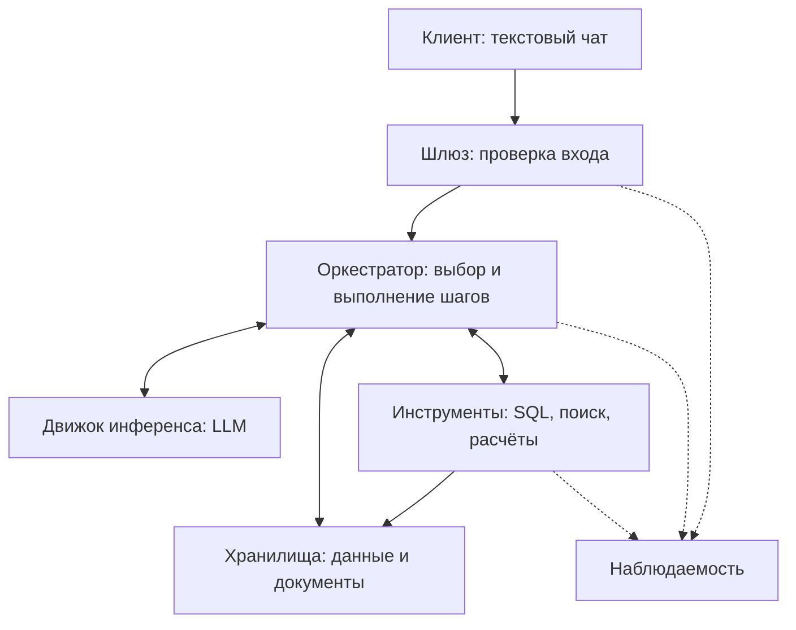

# Design doc: LLM-система для аналитики по структурированным и неструктурированным данным

Основан на шаблоне команды [Reliable ML](https://github.com/IrinaGoloshchapova/ml_system_design_doc_ru/blob/main/ML_System_Design_Doc_Template.md) и на [design doc курса «Современные методы NLP»](https://github.com/xufana/modern_nlp_llm/blob/main/hw/hw_01.md).

| Поле | Значение |
|---|---|
| Авторы | Имена и группа пока не указаны |
| Версия | 0.2 |
| Статус | Черновик КТ1 |
| Обновлён | 04.10.2026 |
| ADR | Пока не подготовлены |

## Как пользоваться шаблоном

На КТ1 заполнены контекст, контракт, предварительные бюджеты, набросок схемы, 20 вопросов и открытые вопросы. Остальные пункты будут заполнены на следующих контрольных точках.

## 1. Контекст проекта

### 1.1 Бизнес-задача

- **Проблема.** Корпоративная информация распределена между источниками: числовые и событийные данные находятся в SQL-базе, а условия тарифов, правила и история изменений продукта находятся в документах. Для ответа на бизнес-вопрос сотруднику приходится искать информацию и обращаться к аналитику.
- **Почему использовать LLM.** Поиск по документам не выполняет анализ SQL-данных, а готовый SQL-запрос не объясняет связанный с показателем бизнес-контекст. LLM может интерпретировать вопрос на естественном языке и определить, какие источники нужны. Полезность такого подхода необходимо проверить, сравнив его с более простыми решениями.
- **Почему решение имеет смысл.** Система объединяет получение числовых данных, поиск документов и расчёты. Пользователь получает ответ с источниками и не обязан знать SQL.
- **Критерии успеха с точки зрения бизнеса.** Сокращение времени получения проверяемого ответа и количества типовых запросов к аналитику. Пользовательская ценность определяется временем решения задачи и долей вопросов, которые пользователь может решить самостоятельно. Численные бизнес-цели пока не определены.

**Альтернатива без системы:** аналитик, самостоятельная работа с SQL/BI/Excel или отказ от анализа. Для предварительного сравнения принимаем условные 30 минут работы аналитика на типовой вопрос и стоимость часа 1 500-3 000 ₽. Тогда один ответ стоит 750-1 500 ₽ рабочего времени. Это расчётное допущение для КТ1, а не измеренная стоимость в конкретной компании.

### 1.2 Пользователи и сценарии использования

- **Кто.** Внутренние пользователи небольших и средних компаний: руководители, product-менеджеры, маркетологи и руководители поддержки. Им нужны аналитические ответы, но они не обязаны знать SQL. Конкретная компания и число пользователей пока не определены.
- **Через что.** Предполагаемый интерфейс: текстовый чат.
- **Нагрузка.** Пока неизвестна. В расчёте месячной стоимости используем количество простых и сложных запросов без предположения о конкретном числе пользователей.
- **Цена ошибки.** Неверный показатель или неподтверждённое объяснение может привести к ошибочному бизнес-решению. Поэтому ответ должен содержать источники и ограничения вывода, а решения с высокой ценой ошибки требуют проверки человеком.
- **Что для пользователя «хорошо».** Получить понятный ответ быстрее, чем при самостоятельном сборе данных, и иметь возможность проверить числа и документы.

### 1.3 Границы, ограничения и допущения

**Границы системы.** В первой версии используются 2 типа источников: одна SQL-база и один набор текстовых документов.

| Внутри (наш код, наши данные) | Снаружи (провайдер, внешний API, чужой сервис) |
|---|---|
| Обработка вопроса, выбор источников, выполнение разрешённых SQL-запросов | Доступность и поведение внешней модели, если будет выбран API |
| Поиск документов, расчёты, формирование ответа с источниками | Качество исходных корпоративных данных |
| Ограничение доступа к инструментам и оценка качества системы | Решение пользователя на основании ответа |

**Что явно не делаем:**

1. Не изменяем корпоративные данные и не принимаем бизнес-решения вместо пользователя.
2. Не подключаем произвольное количество баз, CRM, почту и внешние API в первой версии.
3. Не обрабатываем изображения, аудио и видео.
4. Не доказываем причинную связь только по корреляции и совпадению дат.
5. Не заменяем полноценную BI-платформу и не строим сложные долгосрочные прогнозы.

**Допущения.** Предполагается, что SQL-база и документы позволяют отвечать на выбранные аналитические вопросы. Предметная область, происхождение и объём демонстрационных данных, модель и инфраструктура пока не выбраны. Запросы вне подключённых данных получают отказ.

## 2. Контракт сервиса

### 2.1 Контракт

| Поле | Что обещаем | Как проверим |
|---|---|---|
| **Вход** | Текстовый вопрос на русском языке по подключённым данным компании | Вопросы разных категорий из набора в 5.1 |
| **Выход** | Ответ на вопрос, необходимые числа с единицами и периодом, ссылки на использованные документы и сведения об использованных SQL-данных | Сравнение с правильным ответом и проверка источников; целевые показатели в 3.1 |
| **Поведение при неуверенности** | Уточнение неоднозначной метрики или периода; сообщение о недостатке данных, если ответ не подтверждается источниками | Доля корректных уточнений и отказов на соответствующих вопросах |
| **Чего не обещаем** | Отсутствие любых ошибок, доказательство причинности по совпадению событий, ответы вне доступных данных | Проверка неподтверждённых утверждений и поведения вне области задачи |
| **Нефункциональные** | Только чтение корпоративных данных; целевые ограничения времени и стоимости для 2 конфигураций | Проверка доступа; измерение времени и расходов на запрос, разделы 3.2 и 3.3 |

**Контракт одной фразой:**

> На аналитический вопрос на русском языке система возвращает ответ по SQL-базе и текстовым документам с указанием источников; при неоднозначности задаёт уточнение, при недостатке данных сообщает об этом; целевое время полного ответа для 95% запросов составляет не более 15 секунд в простой конфигурации и 40 секунд в сложной, а стоимость ограничена $0.01 и $0.05 соответственно.

Все показатели являются предварительными целями КТ1, а не достигнутыми результатами.

### 2.2 Сценарии взаимодействия

**Основные сценарии.**

| Сценарий | Пример запроса | Что делает система | Результат для пользователя |
|---|---|---|---|
| SQL | Сколько новых платящих клиентов появилось в сентябре? | Получает данные из базы | Число, период и сведения об источнике |
| Документы | Какие условия возврата действуют для тарифа Pro? | Находит соответствующий документ | Условия и ссылка на источник |
| SQL и вычисления | На сколько процентов выросла выручка с июля по сентябрь? | Получает суммы и выполняет расчёт программно | Исходные значения и изменение |
| SQL и документы | Как изменился отток после последнего повышения цены? | Находит дату изменения и сравнивает показатели | Сравнение с источниками, без необоснованного причинного вывода |
| Многошаговый вопрос | Найди 3 сегмента с максимальным падением удержания и изменения продукта в этот период | Сначала определяет сегменты и период, затем ищет документы | Ранжированный результат и связанный контекст |
| Уточнение | У нас стало хуже с клиентами. Что произошло? | Уточняет показатель и период | Конкретный уточняющий вопрос |

**Исключительные сценарии.**

| Ситуация | Поведение системы | Что видит пользователь |
|---|---|---|
| Ответа нет в базе | Не придумывает отсутствующие факты | Сообщение о недостатке данных и о том, чего не хватает |
| Не поняли запрос | Запрашивает уточнение | Вопрос о показателе, периоде или объекте анализа |
| Вне домена / попытка выйти за контракт | Отказывает в выполнении | Сообщение, что система отвечает по подключённым аналитическим данным |
| Инструмент не ответил / вернул ошибку | Не выдаёт неудавшийся расчёт за выполненный | Сообщение о недоступности данных; при наличии частичного результата отмечает его ограничения |
| Модель вернула невалидный формат или зациклилась | Останавливает обработку при исчерпании ограничений | Сообщение, что запрос не удалось завершить |
| Нужен человек | Указывает, что требуется дополнительная проверка или исследование | Рекомендация обратиться к аналитику; автоматическая передача оператору не предусмотрена |

### 2.3 Диалоговая логика и тон

- **Single-turn или multi-turn.** Основной сценарий: вопрос и ответ. Дополнительная реплика нужна, если пользователь должен уточнить показатель или период.
- **История диалога.** Для уточнения используется контекст текущего вопроса. Способ хранения и ограничения истории пока не выбраны.
- **Долгая память о пользователе.** Не требуется для первой версии.
- **Тон и стиль.** Русский язык, нейтральный деловой тон, понятные определения и единицы измерения. Не делаем категоричных выводов без данных.
- **Прозрачность.** Пользователю должно быть понятно, что ответ сформирован автоматически; источники доступны для проверки.

## 3. Три бюджета и SLO

### 3.1 Качество

| Метрика (из контракта) | Как считаем | Целевое значение |
|---|---|---|
| Правильность числового ответа | Доля вопросов с однозначным числовым ответом, где значение, единицы и период соответствуют эталону | ≥ 85% |
| Выполнение SQL | Доля SQL-задач, в которых получен выполняемый запрос | ≥ 90% |
| Правильность SQL-результата | Доля SQL-задач, результат которых соответствует вопросу и эталону; выполнение без ошибки само по себе не считается успехом | ≥ 85% |
| Поиск документов | Для каждого вопроса доля необходимых документов среди первых 5 результатов, затем среднее по вопросам | Recall@5 ≥ 90% |
| Подтверждённость ответа | Неподтверждённые проверяемые утверждения / все проверяемые утверждения | ≤ 10% |
| Недостаток информации | Доля вопросов без достаточных данных, где система корректно отказывается или просит необходимое уточнение | ≥ 80% |
| Неоднозначность | Доля неоднозначных вопросов, где запрошено необходимое уточнение | ≥ 80% |

Правильность ответа проверяется по данным и документам, а не по убедительности формулировки. На КТ1 эти показатели задают направление оценки; правильные ответы и полная методика ещё не подготовлены.

### 3.2 Задержка

Рассматриваются 2 конфигурации.

| Конфигурация | Назначение | Целевое время полного ответа |
|---|---|---|
| A: быстрая | Простые вопросы, например получение одного показателя из SQL или ответа из документа | Не менее 95% запросов завершаются за ≤ 15 с |
| B: для сложных вопросов | Несколько зависимых действий, объединение SQL и документов, дополнительная проверка | Не менее 95% запросов завершаются за ≤ 40 с |

Это предварительные ограничения, а не результаты измерений. Длительность отдельных этапов и время до первого токена пока не оценены: модель и стек не выбраны. Решение о стриминге также не принято.

### 3.3 Стоимость

| Параметр | Конфигурация A | Конфигурация B | Откуда |
|---|---|---|---|
| Целевой предел стоимости запроса | ≤ $0.01 | ≤ $0.05 | Предварительный бюджет КТ1 |
| Бюджет на 1 000 запросов | ≤ $10 | ≤ $50 | Предел на запрос × 1 000; это единица сравнения, а не предположение о нагрузке |
| Месячный бюджет | ≤ $0.01 × Q_A | ≤ $0.05 × Q_B | Q_A и Q_B: фактическое число запросов соответствующего типа за месяц |

Общий месячный бюджет обработки запросов: **$0.01 × Q_A + $0.05 × Q_B**. Распределение вопросов по конфигурациям и месячная нагрузка пока неизвестны.

Стоимость LLM будет рассчитываться по суммарным входным и выходным токенам всех вызовов, включая повторы, и тарифам выбранной модели. Модель, тарифы и число токенов пока не определены, поэтому фактическая стоимость не заявляется. Указанные пределы относятся к переменным расходам обработки запроса; инфраструктура, подготовка данных и разметка оцениваются отдельно, когда будет выбран стек.

Стоимость альтернативы из 1.1: условно 750-1 500 ₽ рабочего времени аналитика на один типовой вопрос. Сравнение пока предварительное и не доказывает окупаемость продукта.

### 3.4 Компромисс

Приоритет: проверяемый ответ в пределах времени и стоимости. Простые вопросы не должны требовать сложного многошагового анализа, поэтому для них рассматривается конфигурация A. Для сложных вопросов допустим более высокий бюджет B. Если данных недостаточно, уточнение или отказ предпочтительнее неподтверждённого ответа. Выбор архитектуры и необходимость отдельных компонентов будут определяться позже; на КТ1 фиксируем ограничения, а не готовую реализацию.

### 3.5 SLI и SLO

Будет заполнено на следующих контрольных точках.

## 4. Архитектура решения

### 4.1 Схема по семи блокам

Предварительный набросок, без окончательного выбора стека.

Для простого вопроса достаточно выбрать источник, получить данные и сформировать ответ. Для сложного вопроса могут потребоваться планирование, несколько инструментов и проверка найденных фактов. Конкретные библиотеки, способы хранения и отдельные агенты пока не выбраны.

### 4.2 Путь одного запроса

Будет заполнено на следующих контрольных точках.

### 4.3 Данные и база знаний

Будет заполнено на следующих контрольных точках.

### 4.4 Модель и промпты

Будет заполнено на следующих контрольных точках.

### 4.5 Интеграции и интерфейсы

Будет заполнено на следующих контрольных точках.

### 4.6 Инфраструктура и развёртывание

Будет заполнено на следующих контрольных точках.

## 5. Eval-план

### 5.1 Eval-сет

Предварительный набор содержит **20 вопросов**. Они составлены по пользовательским сценариям проекта и показывают, как вопрос может усложняться: от получения одного числа до объединения SQL и нескольких документов.

Состав: 4 SQL-вопроса, 4 вопроса с вычислениями, 4 по документам, 4 смешанных, 2 многошаговых, 1 неоднозначный и 1 предполагаемый случай недостатка данных. Это черновик будущего набора, а не готовая количественная оценка. Правильные значения и необходимый состав источников будут определены после выбора данных. Вопросы с относительными датами также потребуют уточнения при подготовке эталонов.

| № | Категория | Вопрос | Ожидаемое поведение |
|---|---|---|---|
| 1 | SQL | Сколько новых платящих клиентов появилось в сентябре? | Получить число из SQL и указать период. |
| 2 | SQL | Какая выручка была за последний полный месяц? | Определить период и получить показатель из SQL. |
| 3 | SQL | Какой тариф принёс больше всего выручки в третьем квартале? | Сравнить выручку тарифов. |
| 4 | SQL | Какой процент пользователей отменил подписку в течение первых 30 дней? | Использовать согласованное определение показателя. |
| 5 | SQL + расчёт | На сколько процентов выросла месячная выручка с июля по сентябрь? | Получить суммы и вычислить процентное изменение. |
| 6 | SQL + расчёт | Сравни отток клиентов малого бизнеса и enterprise-клиентов за последние шесть месяцев. | Использовать одинаковую метрику и сопоставимые периоды. |
| 7 | SQL + расчёт | Какие три клиентских сегмента сильнее всего выросли по выручке относительно прошлого года? | Сравнить периоды и ранжировать сегменты. |
| 8 | SQL + расчёт | Есть ли месяцы, в которых число новых клиентов выросло, а общая выручка снизилась? | Сопоставить изменения двух показателей. |
| 9 | Документы | Какие условия возврата денег сейчас действуют для тарифа Pro? | Найти актуальные условия и указать документ. |
| 10 | Документы | Когда последний раз менялась стоимость тарифа Enterprise? | Найти дату изменения и источник. |
| 11 | Документы | Какие ограничения были добавлены в последнюю версию SLA? | Сравнить версии документа. |
| 12 | Документы | Какие крупные функции продукта появились в последних трёх релизах? | Найти соответствующие описания релизов. |
| 13 | SQL + документы | Как изменился отток клиентов тарифа Pro после последнего изменения его стоимости? | Найти дату, сравнить показатели, не утверждать причинность. |
| 14 | SQL + документы | Как изменилась частота обращений в поддержку после релиза 2.0? | Совместить дату релиза с SQL-данными. |
| 15 | SQL + документы | После каких изменений тарифов сильнее всего менялось количество новых подписок? | Сопоставить изменения тарифов и показатели. |
| 16 | SQL + документы | Какие изменения продукта происходили примерно в тот период, когда удержание enterprise-клиентов начало снижаться? | Определить период снижения, затем найти документы. |
| 17 | Многошаговый | Найди три сегмента клиентов с самым большим падением удержания за последний квартал и проверь, какие изменения продукта или тарифов происходили для них в этот период. | Определить сегменты, затем собрать контекст по ним. |
| 18 | Многошаговый | Какие продуктовые изменения совпали по времени с наиболее сильными изменениями оттока клиентов за последний год? Не утверждай причинную связь, если её нельзя доказать. | Объединить показатели и документы, ограничить вывод. |
| 19 | Неоднозначный | У нас стало хуже с клиентами в последнее время. Что произошло? | Уточнить показатель и период. |
| 20 | Недостаток данных | Почему клиенты стали меньше рекомендовать наш продукт друзьям? | При отсутствии нужных данных сообщить об ограничении, не придумывать причину. |

### 5.2 Метрики

Будет заполнено на следующих контрольных точках.

### 5.3 Процедура

Будет заполнено на следующих контрольных точках.

### 5.4 Контроль качества в рантайме

Будет заполнено на следующих контрольных точках.

## 6. Baseline и план усложнений

### 6.1 Baseline

Будет заполнено на следующих контрольных точках.

### 6.2 Усложнения

Будет заполнено на следующих контрольных точках.

## 7. Риски, ограничения, безопасность

### 7.1 Структурные ограничения модели и чем закрываем

Будет заполнено на следующих контрольных точках.

### 7.2 Риски проекта

Будет заполнено на следующих контрольных точках.

### 7.3 Безопасность, соответствие, этика

Будет заполнено на следующих контрольных точках.

## 8. План работ и эксплуатация

### 8.1 Этапы

Будет заполнено на следующих контрольных точках.

### 8.2 Поддержка и эксплуатация

Будет заполнено на следующих контрольных точках.

## 9. Ресурсы

Будет заполнено на следующих контрольных точках.

## 10. Открытые вопросы

| Вопрос | Владелец | Срок | Статус |
|---|---|---|---|
| Какую предметную область выбираем для демонстрационных данных? | Команда | К КТ2 | Открыт |
| Используем синтетические данные или публичный набор как основу? | Команда | К КТ2 | Открыт |
| Как определяем выручку, отток и удержание, чтобы ответ можно было однозначно проверить? | Команда | К КТ2 | Открыт |
| Какие периоды сравниваем в вопросах «до и после» и как обрабатываем неоднозначность? | Команда | К КТ2 | Открыт |
| Как задаём правильный ответ для вопроса с числами и интерпретацией? | Команда | К КТ2 | Открыт |
| Какая модель подходит по качеству, времени и стоимости? | Команда | При выборе стека | Открыт |
| Нужны ли отдельный планировщик и компонент проверки для основной задачи? | Команда | При выборе архитектуры | Открыт |

## 11. Приложения

Будет заполнено на следующих контрольных точках.

## История изменений

| Дата | Версия | Что изменилось | Почему |
|---|---|---|---|
| 04.10.2026 | 0.1 | Первоначальное заполнение документа | Подготовка КТ1 |
| 04.10.2026 | 0.2 | Оставлены только пункты КТ1, убраны дополнительные разделы и необязательные численные предположения | Уточнение объёма документа |

## Чек-лист перед сдачей

- [x] Описаны проблема, пользователь и ценность системы.
- [x] Названа альтернатива без системы и дана предварительная оценка её стоимости.
- [x] Контракт содержит проверяемые обещания и исключительные сценарии.
- [x] Есть численные цели качества, времени и стоимости.
- [x] Месячная стоимость выражена через нагрузку; неизвестная нагрузка не выдана за факт.
- [x] Есть предварительная схема и 20 вопросов разных категорий.
- [x] Перечислены открытые вопросы.
- [ ] Внесены имена авторов и учебная группа.
