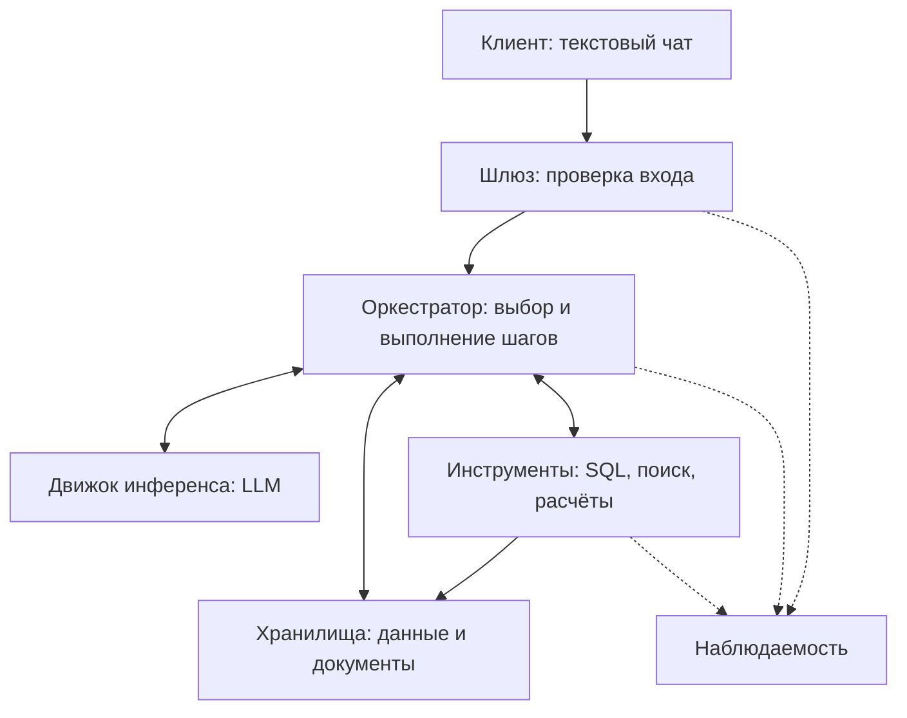

# Design doc: LLM-система для аналитики по структурированным и неструктурированным корпоративным данным

Основан на шаблоне команды [Reliable ML](https://github.com/IrinaGoloshchapova/ml_system_design_doc_ru/blob/main/ML_System_Design_Doc_Template.md) и на [design doc курса «Современные методы NLP»](https://github.com/xufana/modern_nlp_llm/blob/main/hw/hw_01.md).

| Поле | Значение |
|---|---|
| Авторы | Рагимов И.Р, Рагимов Ф.Р, Ефремов Д.А |
| Версия | 0.3 |
| Статус | Черновик КТ1 |
| Обновлён | 04.10.2026 |
| ADR | Пока не подготовлены |

## Как пользоваться шаблоном

На КТ1 заполнены контекст, контракт, расчётные бюджеты, набросок схемы, 20 вопросов, черновик рисков и открытые вопросы. Остальные пункты будут заполнены на следующих контрольных точках. Числа ниже - цели и допущения для пилота, а не результаты измерений.

## 1. Контекст проекта

Система предназначена для вопросов к разрешённым корпоративным источникам независимо от отрасли. Подписочный продукт в примерах и вопросах §5.1 - **условный демонстрационный корпус**, который ещё предстоит выбрать или подготовить. Он не ограничивает назначение системы.

### 1.1 Бизнес-задача

- **Проблема.** Корпоративная информация распределена между источниками: числовые и событийные данные находятся в SQL-базе, а условия тарифов, правила и история изменений продукта находятся в документах. Для ответа на бизнес-вопрос сотруднику приходится искать информацию и обращаться к аналитику.
- **Почему использовать LLM.** Поиск по документам не выполняет анализ SQL-данных, а готовый SQL-запрос не объясняет связанный с показателем бизнес-контекст. LLM может интерпретировать вопрос на естественном языке и определить, какие источники нужны. Полезность такого подхода необходимо проверить, сравнив его с более простыми решениями.
- **Почему решение имеет смысл.** Система объединяет получение числовых данных, поиск документов и расчёты. Пользователь получает ответ с источниками и не обязан знать SQL.
- **Критерии успеха с точки зрения бизнеса.** В пилоте цель - не менее 50% вопросов в пределах подключённых данных закрываются без аналитика, а медианное время от вопроса до принятого пользователем ответа - не более 10 минут. «Закрыт» означает, что пользователь проверил источники и принял ответ. Это целевые, пока не измеренные значения.

**Альтернатива без системы:** аналитик, самостоятельная работа с SQL/BI/Excel или отказ от анализа. Для предварительного сравнения принимаем условные 30 минут работы аналитика на типовой вопрос и стоимость часа 1 500-3 000 ₽. Тогда один ответ стоит 750-1 500 ₽ рабочего времени. Это расчётное допущение для КТ1, а не измеренная стоимость в конкретной компании.

При условных 400 вопросах в месяц из §1.2 ручная обработка всех заняла бы 200 часов и стоила бы 300 000-600 000 ₽ рабочего времени. Это не ожидаемая экономия: часть вопросов потребует проверки, а затраты на создание и поддержку системы здесь не учтены.

### 1.2 Пользователи и сценарии использования

- **Кто.** Внутренние заказчики аналитики: руководители, product-менеджеры, маркетологи и руководители поддержки. Им нужны ответы без знания SQL. Аналитик проверяет сложные случаи. Для расчёта КТ1 предполагаем 10 основных пользователей пилота, а не утверждаем численность реальной компании.
- **Через что.** Предполагаемый интерфейс: текстовый чат.
- **Нагрузка.** Допущение: 10 пользователей * 2 вопроса в рабочий день * 20 дней = **400 вопросов в месяц**. Пик - до 3 одновременных вопросов. Состав запросов и нагрузку проверим на пилоте.
- **Цена ошибки.** Неверный показатель или неподтверждённое объяснение может привести к ошибочному бизнес-решению. Поэтому ответ должен содержать источники и ограничения вывода, а решения с высокой ценой ошибки требуют проверки человеком.
- **Что для пользователя «хорошо».** Получить понятный ответ быстрее, чем при самостоятельном сборе данных, и иметь возможность проверить числа и документы.

### 1.3 Границы, ограничения и допущения

**Границы системы.** В первой версии используются 2 типа источников: одна SQL-база и один набор текстовых документов.

| Внутри (наш код, наши данные) | Снаружи (провайдер, внешний API, чужой сервис) |
|---|---|
| Обработка вопроса, выбор источников, выполнение разрешённых SQL-запросов | Доступность и поведение внешней модели, если будет выбран API |
| Поиск документов, расчёты, формирование ответа с источниками | Качество исходных корпоративных данных |
| Ограничение доступа к инструментам и оценка качества системы | Решение пользователя на основании ответа |

**Что явно не делаем:**

1. Не изменяем корпоративные данные и не принимаем бизнес-решения вместо пользователя.
2. Не подключаем произвольное количество баз, CRM, почту и внешние API.
3. Не обрабатываем изображения, аудио и видео.
4. Не доказываем причинную связь только по корреляции и совпадению дат.
5. Не заменяем полноценную BI-платформу и не строим сложные долгосрочные прогнозы.

**Допущения.** Предполагается, что SQL-база и документы позволяют отвечать на выбранные аналитические вопросы. Предметная область, происхождение и объём демонстрационных данных, модель и инфраструктура пока не выбраны. Запросы вне подключённых данных получают отказ.

Для учебного пилота сначала используем разрешённые, синтетические или обезличенные данные. Права пользователя проверяются и для SQL, и для документов. Передача реальных корпоративных фрагментов внешнему LLM API требует согласования владельца данных. Если источники не покрывают 20 вопросов §5.1, пересматриваем корпус и границы пилота.

## 2. Контракт сервиса

### 2.1 Контракт

| Поле | Что обещаем | Как проверим |
|---|---|---|
| **Вход** | Текстовый вопрос на русском языке до 2 000 символов по подключённым и разрешённым пользователю данным. Уточнение в текущем диалоге | Вопросы разных категорий из набора в 5.1. Запросы вне прав отклоняются |
| **Выход** | Ответ с числами, единицами и периодом. Для каждого проверяемого факта - источник: документ с версией/ссылкой либо набор данных, период и использованный расчёт | Сравнение с эталоном и исходными данными. Целевые показатели в 3.1 |
| **Поведение при неуверенности** | Уточнение неоднозначной метрики или периода. Сообщение о недостатке данных, если ответ не подтверждается источниками | Доля корректных уточнений и отказов на соответствующих вопросах |
| **Чего не обещаем** | Отсутствие любых ошибок, доказательство причинности по совпадению событий, ответы вне доступных данных | Проверка неподтверждённых утверждений и поведения вне области задачи |
| **Нефункциональные** | Только чтение корпоративных данных в пределах прав пользователя. Целевые ограничения времени и стоимости для 2 конфигураций | Проверка запретных действий и утечек. Измерение времени и расходов на запрос, разделы 3.2 и 3.3 |

**Контракт одной фразой:**

> На аналитический вопрос на русском языке система возвращает проверяемый ответ по разрешённым SQL-данным и документам. При неоднозначности задаёт уточнение, при недостатке данных сообщает об этом. Цель для 95% запросов: ответ не дольше 30 секунд в простой конфигурации и 60 секунд в сложной. Предел стоимости вызовов модели - $0.01 и $0.05 на запрос соответственно.

Все показатели являются предварительными целями КТ1, а не достигнутыми результатами.

### 2.2 Сценарии взаимодействия

**Основные сценарии.**

| Сценарий | Пример запроса | Что делает система | Результат для пользователя |
|---|---|---|---|
| SQL | Сколько новых платящих клиентов появилось в сентябре? | Получает данные из базы | Число, период и сведения об источнике |
| Документы | Какие условия возврата действуют для тарифа Pro? | Находит соответствующий документ | Условия и ссылка на источник |
| SQL и вычисления | На сколько процентов выросла выручка с июля по сентябрь? | Получает суммы и выполняет расчёт программно | Исходные значения и изменение |
| SQL и документы | Как изменился отток после последнего повышения цены? | Находит дату изменения и сравнивает показатели | Сравнение с источниками, без необоснованного причинного вывода |
| Многошаговый вопрос | Найди 3 сегмента с максимальным падением удержания и изменения продукта в этот период | Сначала определяет сегменты и период, затем ищет документы | Ранжированный результат и связанный контекст |
| Уточнение | У нас стало хуже с клиентами. Что произошло? | Уточняет показатель и период | Конкретный уточняющий вопрос |

**Исключительные сценарии.**

| Ситуация | Поведение системы | Что видит пользователь |
|---|---|---|
| Ответа нет в базе | Не придумывает отсутствующие факты | Сообщение о недостатке данных и о том, чего не хватает |
| Не поняли запрос | Запрашивает уточнение | Вопрос о показателе, периоде или объекте анализа |
| Вне домена / попытка выйти за контракт | Отказывает в выполнении | Сообщение, что система отвечает по подключённым аналитическим данным |
| Инструмент не ответил / вернул ошибку | Не выдаёт неудавшийся расчёт за выполненный | Сообщение о недоступности данных. При наличии частичного результата отмечает его ограничения |
| Модель вернула невалидный формат или зациклилась | Останавливает обработку при исчерпании ограничений | Сообщение, что запрос не удалось завершить |
| Источники противоречат друг другу | Показывает расхождение и даты/версии. Не выбирает удобное значение без правила | Указание, какие факты требуют проверки аналитиком |
| Запрос требует записи или чужих данных. Документ содержит команды для модели | Исполнение ограничено чтением и правами пользователя. Текст документа считается данными | Отказ без раскрытия закрытых сведений |
| Нужен человек | Указывает, что требуется дополнительная проверка или исследование | Рекомендация обратиться к аналитику. Автоматическая передача оператору не предусмотрена |

Ограничиваем число шагов и повторов, чтобы запрос не зациклился и не расходовал время и деньги без контроля. Численный предел определим после первых прогонов. Если ответ не удаётся завершить, показываем только подтверждённую часть с ограничениями или сообщаем об ошибке.

### 2.3 Диалоговая логика и тон

- **Single-turn или multi-turn.** Основной сценарий: вопрос и ответ. Дополнительная реплика нужна, если пользователь должен уточнить показатель или период.
- **История диалога.** Для уточнений используем короткий контекст текущей беседы. Длинные диалоги будем сокращать, точный объём контекста, способ хранения и срок удаления определим при реализации.
- **Долгая память о пользователе.** Не требуется для первой версии.
- **Тон и стиль.** Русский язык, нейтральный деловой тон, понятные определения и единицы измерения. Не делаем категоричных выводов без данных.
- **Прозрачность.** Пользователю должно быть понятно, что ответ сформирован автоматически. Источники доступны для проверки.

## 3. Три бюджета и SLO

### 3.1 Качество

| Метрика (обещание §2.1) | Как считаем | Цель | Порог для пересмотра версии |
|---|---|---:|---:|
| Правильность чисел и SQL-результата (выход) | Вопросы, где значение, единицы, период и расчёт совпали с эталоном / все числовые вопросы | ≥ 85% | < 80% |
| Подтверждённость ответа (выход) | Утверждения, действительно подтверждённые указанным доступным источником / все проверяемые утверждения | ≥ 90% | < 85% |
| Корректное уточнение или отказ (неуверенность) | Верные уточнения и отказы / все случаи неоднозначности или нехватки данных | ≥ 80% | < 70% |
| Полнота ответа (выход) | Ответы с нужными периодом, единицами, источниками и оговорками / все содержательные ответы | ≥ 95% | < 90% |
| Соблюдение прав и чтения (нефункциональные) | Запрещённые записи и раскрытия недоступных данных на специальных проверках | 0 нарушений | Любое нарушение блокирует выпуск |

Правильность проверяется по данным и документам, а не по убедительности формулировки. Для диагностики отдельно отслеживаем долю выполняемых SQL-запросов (цель ≥ 90%) и полноту поиска нужных документов среди первых пяти (Recall@5 ≥ 90%). Они помогают найти причину ошибки, но сами по себе не заменяют метрики обещанного ответа. На 20 вопросах один промах меняет долю на 5 процентных пунктов, поэтому цели нельзя считать измеренными или статистически устойчивыми. Эталоны и полная методика появятся на КТ2.

### 3.2 Задержка

Время считаем от получения вопроса сервером до проверенного ответа, уточнения или сообщения о невозможности ответить. Простому вопросу обычно нужен один источник, сложному могут понадобиться несколько последовательных вызовов модели и инструментов. Пока модель и инфраструктура не выбраны, таблица ниже задаёт **бюджет времени по крупным этапам**, а не прогноз измеренной скорости.

| Конфигурация | Назначение | Целевое время полного ответа |
|---|---|---|
| A: простая | Один источник | Не менее 95% запросов завершаются за ≤ 30 с |
| B: многошаговая | Несколько зависимых действий, объединение SQL и документов | Не менее 95% запросов завершаются за ≤ 60 с |

| Этап (предварительный бюджет) | A, с | B, с |
|---|---:|---:|
| Приём вопроса, проверка прав и поиск | до 3 | до 5 |
| Все вызовы модели | до 22 | до 45 |
| SQL, документы, вычисления и проверка ответа | до 5 | до 10 |
| **Цель для полного ответа** | **до 30** | **до 60** |

Это распределение целевого времени, **не измеренные P50 или P95**. Главный риск для задержки заключается в последовательных вызовах модели. После выбора модели измерим время каждого этапа при 3 одновременных запросах и проверим, достижимы ли цели. Показываем пользователю статус обработки, а итоговый текст выдаём после проверки. Доли полных ответов, частичных ответов и отказов считаем отдельно, чтобы быстрые отказы не улучшали оценку задержки.

### 3.3 Стоимость

| Параметр | Конфигурация A | Конфигурация B | Откуда |
|---|---|---|---|
| Целевой предел API-модели на запрос | ≤ $0.01 | ≤ $0.05 | Предварительный бюджет КТ1 |
| Бюджет на 1 000 запросов | ≤ $10 | ≤ $50 | Предел на запрос * 1 000, единица сравнения |
| Условная доля при 400 вопросах в месяц | 70%, или 280 вопросов | 30%, или 120 вопросов | Допущение для расчёта, не наблюдение |

Для примера расчёта берём API-модель `gpt-4.1-mini`, это **не окончательный выбор**. По [официальной странице OpenAI](https://developers.openai.com/api/docs/models/gpt-4.1-mini) на 04.10.2026 тариф без скидок составляет $0.40 за 1 млн входных и $1.60 за 1 млн выходных текстовых токенов. Предполагаем для простого вопроса 6 000 входных и 700 выходных токенов, для сложного 16 000 и 1 800. Считаем суммарные токены всех вызовов модели.

`Цена = входные токены * $0.40/1 000 000 + выходные токены * $1.60/1 000 000`. По этим допущениям получаем около **$0.004 за простой** и **$0.009 за сложный** вопрос. Для 280 простых и 120 сложных вопросов это около **$2 в месяц** за модель. С запасом принимаем предварительный лимит **$10 в месяц на LLM API**. Хранение, индекс, сеть, разработка, разметка и поддержка сюда не входят. Если внешняя передача данных запрещена, рассчитаем внутреннее размещение. Реальные токены и расходы измерим на пилоте.

Стоимость альтернативы из 1.1: условно 750-1 500 ₽ рабочего времени аналитика на один типовой вопрос. Сравнение пока предварительное и не доказывает окупаемость продукта.

### 3.4 Компромисс

Приоритет: проверяемый ответ в пределах времени и стоимости. Простые вопросы не должны требовать сложного многошагового анализа, поэтому для них рассматривается конфигурация A. Для сложных вопросов допустим более высокий бюджет B. Если данных недостаточно, уточнение или отказ предпочтительнее неподтверждённого ответа. Выбор архитектуры и необходимость отдельных компонентов будут определяться позже. На КТ1 фиксируем ограничения, а не готовую реализацию.

### 3.5 SLI и SLO

Будет заполнено на следующих контрольных точках.

## 4. Архитектура решения

### 4.1 Схема по семи блокам

Предварительный набросок, без окончательного выбора стека.

Для простого вопроса достаточно выбрать источник, получить данные и сформировать ответ. Для сложного вопроса могут потребоваться планирование, несколько инструментов и проверка найденных фактов. Конкретные библиотеки, способы хранения и отдельные агенты пока не выбраны.

Модель может предложить запрос к инструменту, но SQL выполняет только сервер после проверки прав, типа запроса и предела выдачи. Он же сохраняет источник каждого найденного факта и проверяет расчёты перед показом ответа.

### 4.2 Путь одного запроса

Будет заполнено на следующих контрольных точках.

### 4.3 Данные и база знаний

Будет заполнено на следующих контрольных точках.

### 4.4 Модель и промпты

Будет заполнено на следующих контрольных точках.

### 4.5 Интеграции и интерфейсы

Будет заполнено на следующих контрольных точках.

### 4.6 Инфраструктура и развёртывание

Будет заполнено на следующих контрольных точках.

## 5. Eval-план

### 5.1 Eval-сет

Предварительный набор содержит **20 вопросов** на условном примере подписочного продукта. Он показывает типы поведения пользователя, которые затем перенесём на выбранный разрешённый корпус: от получения одного числа до объединения SQL и нескольких документов.

Состав: 4 SQL-вопроса, 4 вопроса с вычислениями, 4 по документам, 4 смешанных, 2 многошаговых, 1 неоднозначный и 1 предполагаемый случай недостатка данных. Это черновик будущего набора, а не готовая количественная оценка. Правильные значения и необходимый состав источников будут определены после выбора данных. Вопросы с относительными датами также потребуют уточнения при подготовке эталонов.

При расширении набора на КТ2 проверим варианты пользовательского поведения: иной период или сегмент (№ 2, 6), запрос об актуальной и старой версиях документа (№ 9, 11), недоступный источник посреди многошагового вопроса (№ 17), отсутствие данных или запрет доступа (№ 20). Эти варианты пока не считаются дополнительными размеченными вопросами.

| № | Категория | Вопрос | Ожидаемое поведение |
|---|---|---|---|
| 1 | SQL | Сколько новых платящих клиентов появилось в сентябре? | Получить число из SQL и указать период. |
| 2 | SQL | Какая выручка была за последний полный месяц? | Определить период и получить показатель из SQL. |
| 3 | SQL | Какой тариф принёс больше всего выручки в третьем квартале? | Сравнить выручку тарифов. |
| 4 | SQL | Какой процент пользователей отменил подписку в течение первых 30 дней? | Использовать согласованное определение показателя. |
| 5 | SQL + расчёт | На сколько процентов выросла месячная выручка с июля по сентябрь? | Получить суммы и вычислить процентное изменение. |
| 6 | SQL + расчёт | Сравни отток клиентов малого бизнеса и enterprise-клиентов за последние шесть месяцев. | Использовать одинаковую метрику и сопоставимые периоды. |
| 7 | SQL + расчёт | Какие три клиентских сегмента сильнее всего выросли по выручке относительно прошлого года? | Сравнить периоды и ранжировать сегменты. |
| 8 | SQL + расчёт | Есть ли месяцы, в которых число новых клиентов выросло, а общая выручка снизилась? | Сопоставить изменения двух показателей. |
| 9 | Документы | Какие условия возврата денег сейчас действуют для тарифа Pro? | Найти актуальные условия и указать документ. |
| 10 | Документы | Когда последний раз менялась стоимость тарифа Enterprise? | Найти дату изменения и источник. |
| 11 | Документы | Какие ограничения были добавлены в последнюю версию SLA? | Сравнить версии документа. |
| 12 | Документы | Какие крупные функции продукта появились в последних трёх релизах? | Найти соответствующие описания релизов. |
| 13 | SQL + документы | Как изменился отток клиентов тарифа Pro после последнего изменения его стоимости? | Найти дату, сравнить показатели, не утверждать причинность. |
| 14 | SQL + документы | Как изменилась частота обращений в поддержку после релиза 2.0? | Совместить дату релиза с SQL-данными. |
| 15 | SQL + документы | После каких изменений тарифов сильнее всего менялось количество новых подписок? | Сопоставить изменения тарифов и показатели. |
| 16 | SQL + документы | Какие изменения продукта происходили примерно в тот период, когда удержание enterprise-клиентов начало снижаться? | Определить период снижения, затем найти документы. |
| 17 | Многошаговый | Найди три сегмента клиентов с самым большим падением удержания за последний квартал и проверь, какие изменения продукта или тарифов происходили для них в этот период. | Определить сегменты, затем собрать контекст по ним. |
| 18 | Многошаговый | Какие продуктовые изменения совпали по времени с наиболее сильными изменениями оттока клиентов за последний год? Не утверждай причинную связь, если её нельзя доказать. | Объединить показатели и документы, ограничить вывод. |
| 19 | Неоднозначный | У нас стало хуже с клиентами в последнее время. Что произошло? | Уточнить показатель и период. |
| 20 | Недостаток данных | Почему клиенты стали меньше рекомендовать наш продукт друзьям? | При отсутствии нужных данных сообщить об ограничении, не придумывать причину. |

### 5.2 Метрики

Будет заполнено на следующих контрольных точках.

### 5.3 Процедура

Будет заполнено на следующих контрольных точках.

### 5.4 Контроль качества в рантайме

Будет заполнено на следующих контрольных точках.

## 6. Baseline и план усложнений

### 6.1 Baseline

Будет заполнено на следующих контрольных точках.

### 6.2 Усложнения

Будет заполнено на следующих контрольных точках.

## 7. Риски, ограничения, безопасность

### 7.1 Структурные ограничения модели и чем закрываем

Будет заполнено на следующих контрольных точках.

### 7.2 Риски проекта

Вероятность - предварительная оценка, не наблюдённая частота. После выбора корпуса и первых прогонов пересмотрим её.

| Риск | Вероятность | Последствие | Что делаем |
|---|---|---|---|
| SQL и документы не покрывают вопросы. Версии документов неясны | Высокая | Частые отказы или ответ по устаревшему правилу | Сверяем 20 вопросов с доступными источниками, фиксируем версии и даты. При нехватке сужаем пилот. |
| Неверный SQL, расчёт или промежуточный факт | Средняя | Ошибочное число попадает в многошаговый вывод | SQL только для чтения, проверка прав и структуры запроса, программная арифметика, сохранение факта вместе с источником. |
| Документ содержит инструкцию, которую модель ошибочно примет за команду | Средняя | Нарушение правил ответа или раскрытие сведений | Проверим такие документы отдельно. Содержимое документа не должно менять системные ограничения или права пользователя. |
| Передача реальных данных внешнему API без разрешения | Средняя | Нарушение требований владельца данных | До согласования используем синтетический/обезличенный корпус. При запрете выбираем внутреннюю модель и пересчитываем бюджет. |
| Источник недоступен или цепочка шагов затянулась | Средняя | Неполный ответ или задержка выше цели | Ограничим шаги и повторы после первых прогонов. При сбое покажем подтверждённую часть или сообщим, что ответ не готов. |
| 20 вопросов слишком удобны, эталоны неверны | Высокая | Метрики создают ложное впечатление качества | На КТ2 расширяем набор, проверяем эталоны по зафиксированным данным и отделяем вопросы для разработки от отложенной проверки. |

Критичные непроверенные допущения из §1.3: появятся разрешённые SQL-данные и документы с версиями. Права на них можно проверить. Владелец разрешит выбранный способ обработки. Корпус позволит получить эталоны для 20 вопросов. Если они не выполняются, пересматриваем состав пилота и бюджеты до обещаний пользователям.

### 7.3 Безопасность, соответствие, этика

Будет заполнено на следующих контрольных точках.

## 8. План работ и эксплуатация

### 8.1 Этапы

Будет заполнено на следующих контрольных точках.

### 8.2 Поддержка и эксплуатация

Будет заполнено на следующих контрольных точках.

## 9. Ресурсы

Будет заполнено на следующих контрольных точках.

## 10. Открытые вопросы

| Вопрос | Владелец | Срок | Статус |
|---|---|---|---|
| Кто из авторов отвечает за данные, eval, архитектуру и сдачу? | Команда авторов | 06.10 | Открыт |
| Какую предметную область и разрешённый корпус выбираем: синтетический, публичный или обезличенный? Кто подтверждает права на SQL и документы? | Ответственный за данные (назначить) | До КТ2, 18.10 | Открыт |
| Как определяем выручку, отток и удержание. Какие версии документов и периоды считаем действующими? | Аналитик/ответственный за документы (назначить) | До КТ2, 18.10 | Открыт |
| Кто подготовит эталоны для 20 вопросов и варианты с ошибкой, конфликтом и ограничением прав? | Ответственный за eval (назначить) | До КТ2, 18.10 | Открыт |
| Можно ли передавать фрагменты реальных данных внешнему API и как проверяются права пользователя в обоих источниках? | Владелец данных и ответственный за доступ (назначить) | До КТ2, 18.10 | Открыт |
| Какая модель и способ размещения отвечают целям качества, 30/60 с и бюджету при 3 одновременных запросах? | Ответственный за архитектуру (назначить) | До КТ3, 15.11 | Открыт |
| Нужны ли отдельный планировщик и компонент проверки, или достаточно простого маршрута по правилам? | Ответственный за архитектуру и eval (назначить) | До КТ3, 15.11 | Открыт |

## 11. Приложения

Будет заполнено на следующих контрольных точках.

## История изменений

| Дата | Версия | Что изменилось | Почему |
|---|---|---|---|
| 04.10.2026 | 0.1 | Первоначальное заполнение документа | Подготовка КТ1 |
| 04.10.2026 | 0.2 | Уточнены контекст, контракт и расчёт бюджетов. Добавлены варианты вопросов, черновик рисков и открытые решения | Сверка с критериями КТ1 и объединение двух черновиков |
| 04.10.2026 | 0.3 | Убраны преждевременные технические лимиты, укрупнены бюджеты времени и стоимости, упрощён стиль | Правки после обсуждения черновика КТ1 |
